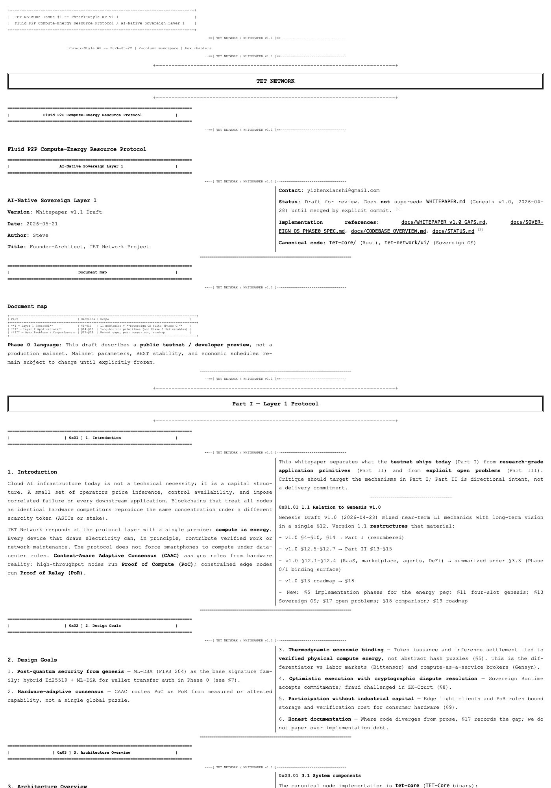

# TET Network



**Post-quantum Layer 1 (ML-DSA) + AI-native workloads + hardware-adaptive consensus.**
Built primarily in Rust (`tet-core`), with a Sovereign OS UI on libp2p.

> ⚠️ **Phase 0 — public testnet / developer preview.**
> Active development toward 2026-09-15 ship target.
> See [`docs/SOVEREIGN_OS_PHASE0_SPEC.md`](./docs/SOVEREIGN_OS_PHASE0_SPEC.md) for the Phase 0 plan
> and [`docs/RUNNING_A_NODE.md`](./docs/RUNNING_A_NODE.md) for operator guidance.

---

## What TET ships in Phase 0

- **Sovereign OS UI** — Win95-style desktop environment (Wallet + Tmail + Files + mini-apps)
- **Tmail** — encrypted P2P messaging with time-locked delivery, burn-after-read, and ZK-anonymous sender
- **Hybrid wallet** — Ed25519 + ML-DSA (FIPS 204) signatures, BIP39 seed compatible
- **Multi-node testnet** — libp2p block plane, faucet, public seed node
- **Energy-pegged tokenomics** — `R(T) = Σ[η(W_i)·C(t_i)] / D(t)` (Phase 0 approximation; formal η in §17.1)

Worker mode (AI inference earn) ships in **Phase 0.5** (post-2026-09-15).

## Canonical components

- [`tet-core/`](./tet-core) — Sovereign Layer 1 node (Rust). **The canonical L1.**
- [`tet-network/ui/`](./tet-network/ui) — Sovereign OS frontend (Next.js)
- [`tet-agent-sdk/`](./tet-agent-sdk) — M2M agent client (TypeScript)
- [`tet-pqc-wasm/`](./tet-pqc-wasm) — Post-quantum signature WASM (ML-DSA-44)
- [`methods/`](./methods), [`prover/`](./prover) — RISC0 zkVM foundation for ZK-Court

## Quick start

```bash
cd tet-core
docker compose up -d
sleep 30
curl http://localhost:5010/ledger/state
curl http://localhost:5020/ledger/state
# UI: http://localhost:3000
```

See [`tet-core/README.md`](./tet-core/README.md) for the 5-minute single-node setup.

## Further reading

### Canonical specifications

- [`WHITEPAPER.md`](./WHITEPAPER.md) — **Whitepaper v1.1** (current, Sovereign OS Suite integrated, 2026-05-21)
- [`docs/WHITEPAPER_v1.1_DRAFT.pdf`](./docs/WHITEPAPER_v1.1_DRAFT.pdf) — Phrack-style PDF (17 pages)
- [`docs/WHITEPAPER_v1.1_DRAFT_JP.md`](./docs/WHITEPAPER_v1.1_DRAFT_JP.md) — Japanese translation
- [`docs/SOVEREIGN_OS_PHASE0_SPEC.md`](./docs/SOVEREIGN_OS_PHASE0_SPEC.md) — Phase 0 ship plan (target: 2026-09-15)

### Project context

- [`docs/FOUNDER_NOTES.md`](./docs/FOUNDER_NOTES.md) — Founder philosophy and design principles
- [`docs/CODEBASE_ATLAS.md`](./docs/CODEBASE_ATLAS.md) — Codebase deep-dive for new contributors
- [`docs/WORKER_MODE_AUDIT.md`](./docs/WORKER_MODE_AUDIT.md) — AI worker mode current state (Phase 0.5 backlog)
- [`docs/AUDIT_WORKER_REGISTER_AND_STAKE.md`](./docs/AUDIT_WORKER_REGISTER_AND_STAKE.md) — Worker register + stake audit
- [`PUBLIC_API.md`](./PUBLIC_API.md) — Public HTTP surface summary

### Archive (historical)

- [`archive/WHITEPAPER_v1.0.md`](./archive/WHITEPAPER_v1.0.md) — Genesis Draft v1.0 (2026-04-28)
- [`archive/LITEPAPER_v0.md`](./archive/LITEPAPER_v0.md) — deprecated short overview
- [`docs/WHITEPAPER_v1.0_GAPS.md`](./docs/WHITEPAPER_v1.0_GAPS.md) — v1.0 vs implementation gaps audit

### Removed workspaces (2026-05-20)

Substrate / Solana experiments and legacy nested copies were **removed from this repository** to reduce clone size and CI noise. Canonical L1 is **`tet-core/`** only.

| Former path | Was |
|-------------|-----|
| `tet-core-node/` | Substrate node template |
| `tet-network/chain/` | Duplicate Substrate chain template |
| `nexus-onchain/` | Solana Anchor experiment |
| `nexus network/` | Legacy nested copies |

To recover sources, check git history before [`32f8eee`](https://github.com/TET-Network-Foundation/TET-OS/commit/32f8eee).

## License

MIT (see [`LICENSE`](./LICENSE) if present).
