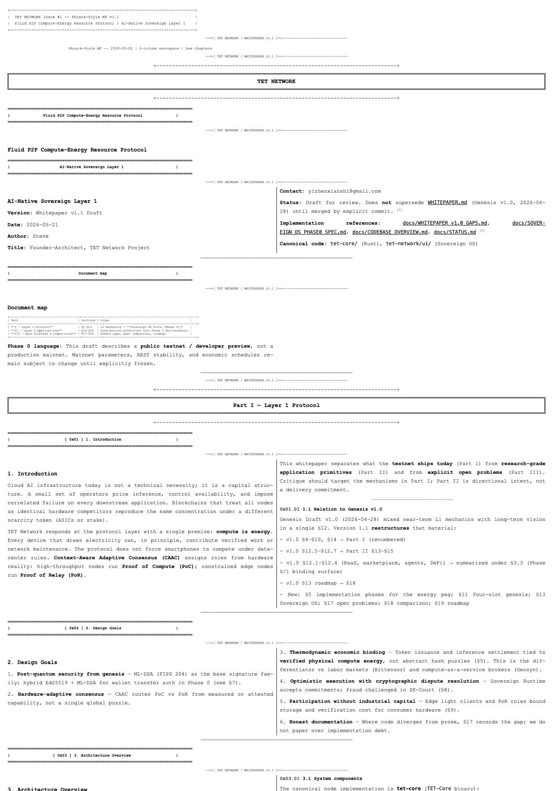

# TET Network



**A Layer 1 whose signatures a quantum computer cannot forge, with a desktop on top of it.**
Written in Rust (`tet-core`): every transaction and message is signed twice, Ed25519 **and**
ML-DSA-44 (FIPS 204), over libp2p. The Sovereign OS UI ships a wallet, encrypted mail and file
sharing as a Win95-style desktop, so the chain is something you use rather than something you query.

> **Your keys, your data, your device — TET only proves, never stores.**
>
> Secrets (passwords, personal data, biometric/neural data, private keys) live only on the user's
> device. The chain holds public keys and proofs. Any design that would put a secret — or anything
> derived from one that could re-identify it — on chain or in replicated state is rejected.

> ⚠️ **Phase 0 — public testnet / developer preview. Unaudited. The token has no value.**
> Read [`SECURITY.md`](./SECURITY.md) before running anything: it lists the known limitations as
> plainly as we can state them, including the ones that are still broken.
> See [`docs/SOVEREIGN_OS_PHASE0_SPEC.md`](./docs/SOVEREIGN_OS_PHASE0_SPEC.md) for the Phase 0 plan
> and [`docs/RUNNING_A_NODE.md`](./docs/RUNNING_A_NODE.md) for operator guidance.

---

## What TET ships in Phase 0

- **Sovereign OS UI** — Win95-style desktop: wallet, Tmail and Files in a tabbed shell
- **Tmail** — encrypted P2P messaging (X25519 + CRYSTALS-Kyber-768 Round-3 + ChaCha20-Poly1305),
  with three things you can try today, all verified between two countries:
  - **Scheduled release** — a message that will not decrypt before a chosen time
  - **Burn-after-read** — the ciphertext is gone from both nodes once it is read
  - **Anonymous sending** — a zero-knowledge proof that the sender is a registered
    user, without revealing which one. Hash-only (SHA-256), so the proof itself has
    nothing in it for a quantum computer to break. From the desktop it needs the
    native prover running on your own computer (`cargo run --release -p tet-prover-host`;
    see [RUNNING_A_NODE § Anonymous sending](./docs/RUNNING_A_NODE.md#anonymous-sending)).
    Without it, the desktop says so instead of sending

  Not built: pinned messages, and the deposit that would make anonymous sending cost
  something. Both are Phase 1 and both have acceptance tests that fail on purpose.
  (WP §17.17 covers the FIPS-203 ML-KEM migration)
- **Hybrid wallet** — Ed25519 + **ML-DSA-44** (FIPS 204, NIST level 2) signatures, BIP39 seed compatible.
  Verification infers the level from public-key length and accepts 44/65/87; operators may select
  65 or 87 node-side via `TET_MLDSA_SECURITY_LEVEL` (WP §7.1)
- **Multi-node testnet** — libp2p block plane, faucet, public seed node
- **Energy-pegged tokenomics** — `R(T) = Σ[η(W_i)·C(t_i)] / D(t)` (Phase 0 approximation; formal η in §17.1)

Worker mode (AI inference earn) ships in **Phase 0.5**, after the Phase 0 ship.

## Canonical components

- [`tet-core/`](./tet-core) — Sovereign Layer 1 node (Rust). **The canonical L1.**
- [`tet-network/ui/`](./tet-network/ui) — Sovereign OS frontend (Next.js)
- [`tet-agent-sdk/`](./tet-agent-sdk) — M2M agent client (TypeScript)
- [`tet-pqc-wasm/`](./tet-pqc-wasm) — Post-quantum signature WASM (ML-DSA-44). **Build artifact is
  gitignored** — a fresh clone must build it before the UI can sign; see
  [`docs/RUNNING_A_NODE.md`](./docs/RUNNING_A_NODE.md)
- [`methods/`](./methods), [`prover/`](./prover) — RISC0 zkVM foundation for ZK-Court

## Quick start — join the live testnet in about 10 minutes

This brings up a node that syncs from the public seed in Helsinki, plus the desktop UI.
Most of the ten minutes is the Docker build.

```bash
git clone https://github.com/TET-Network-Foundation/TET-OS.git
cd TET-OS

# Follow the public seeds. Two are listed: Helsinki produces the blocks, Nuremberg is a
# full node and bootnode that does not mine. Either will catch you up; listing both means
# one being down does not stop you joining.
# TET_AUTO_MINE=0 because the seed produces the blocks -- a second producer on the same
# genesis just races it. TET_PRODUCER_PEERS is the compose default, written out so you can see it:
# your node takes gossiped blocks only from Helsinki's PeerId.
cat >> .env <<'EOF'
TET_ENABLE_P2P=1
TET_PRODUCER_PEERS=local-wallet=12D3KooWNcdESJUC1uhuhrMn5anmsGEBhYgCkE8pCbXf8cD7MSEC
TET_BOOTNODES=/ip4/95.217.158.153/tcp/8002/p2p/12D3KooWNcdESJUC1uhuhrMn5anmsGEBhYgCkE8pCbXf8cD7MSEC,/ip4/46.224.223.54/tcp/8002/p2p/12D3KooWSam648Et2FXCUrqUBM6AEoZR5GAwDnoMG77JnA3ajonM
TET_AUTO_MINE=0
EOF

docker compose -f docker-compose.yml -f docker-compose.dev.yml up -d
```

Then confirm you are actually on the seed's chain. Equal height is **not** enough — a fork can sit
at the same height — so compare `block_id` and `state_root`:

```bash
curl -sf http://127.0.0.1:5010/health/swarm | jq '.peer_count'        # 1 once the dial lands
H=$(curl -sf http://127.0.0.1:5010/ledger/blocks | jq '.[0].height')
curl -sf http://127.0.0.1:5010/ledger/block/$H | jq '.block | {height, block_id, state_root}'
```

Open the desktop at **http://localhost:3000/os**, create a wallet, and the three Tmail features
above work against the live network.

Leave the genesis variables in the committed compose alone: they are what the seed runs, and a
mismatch changes the genesis hash, which makes every signed request fail with
`401 ed25519 verification failed`.

**The seed's REST API is deliberately not public** — only `8002/tcp` is open, so port 5010 in the
commands above is *your* node, not the seed's.

Single node with no network, or the full three-node local stack: [`tet-core/README.md`](./tet-core/README.md).
Operator detail, env reference and troubleshooting: [`docs/RUNNING_A_NODE.md`](./docs/RUNNING_A_NODE.md).

## Further reading

### Canonical specifications

- [`WHITEPAPER.md`](./WHITEPAPER.md) — **Whitepaper v1.1** (current, Sovereign OS Suite integrated, 2026-05-21)
- **Phrack-style PDF** — not tracked; regenerate with `python3 docs/scripts/render_phrack_wp_pdf.py` (see [`docs/WHITEPAPER_BUILD.md`](./docs/WHITEPAPER_BUILD.md))
- [`docs/WHITEPAPER_v1.1_DRAFT_JP.md`](./docs/WHITEPAPER_v1.1_DRAFT_JP.md) — Japanese translation
- [`docs/SOVEREIGN_OS_PHASE0_SPEC.md`](./docs/SOVEREIGN_OS_PHASE0_SPEC.md) — Phase 0 ship plan

### Project context

- [`docs/CODEBASE_ATLAS.md`](./docs/CODEBASE_ATLAS.md) — Codebase deep-dive for new contributors
- [`docs/WORKER_MODE_AUDIT.md`](./docs/WORKER_MODE_AUDIT.md) — AI worker mode current state (Phase 0.5 backlog)
- [`docs/AUDIT_WORKER_REGISTER_AND_STAKE.md`](./docs/AUDIT_WORKER_REGISTER_AND_STAKE.md) — Worker register + stake audit

### Archive (historical)

- [`archive/WHITEPAPER_v1.0.md`](./archive/WHITEPAPER_v1.0.md) — Genesis Draft v1.0 (2026-04-28)
- [`archive/LITEPAPER_v0.md`](./archive/LITEPAPER_v0.md) — deprecated short overview
- [`docs/WHITEPAPER_v1.0_GAPS.md`](./docs/WHITEPAPER_v1.0_GAPS.md) — v1.0 vs implementation gaps audit

### Removed workspaces (2026-05-20)

Substrate / Solana experiments and legacy nested copies were **removed from this repository** to reduce clone size and CI noise. Canonical L1 is **`tet-core/`** only.

| Former path | Was |
|-------------|-----|
| `tet-core-node/` | Substrate node template |
| `tet-network/chain/` | Duplicate Substrate chain template |
| `nexus-onchain/` | Solana Anchor experiment |
| `nexus network/` | Legacy nested copies |

To recover sources, check git history before [`a43eb22`](https://github.com/TET-Network-Foundation/TET-OS/commit/a43eb22).

> Commit hashes before 2026-09-26 were rewritten when key material was purged from history
> (see [`SECURITY.md`](./SECURITY.md)). `32f8eee` was this commit's hash prior to that rewrite.

## License

Dual-licensed under either of

- Apache License, Version 2.0 ([`LICENSE-APACHE`](./LICENSE-APACHE))
- MIT License ([`LICENSE-MIT`](./LICENSE-MIT))

at your option. Unless you explicitly state otherwise, any contribution you
intentionally submit for inclusion in this work shall be dual-licensed as above,
without any additional terms or conditions.
