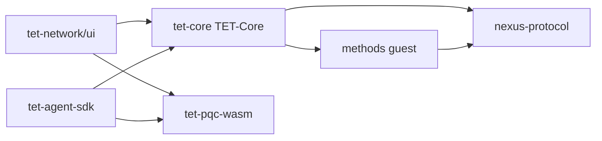

# TET Network — Codebase Atlas

**Version:** 1.0 (draft for review)  
**Date:** 2026-05-21  
**Audience:** External engineers (Protocol Labs, VC diligence), new contributors, AI-assisted review  
**Read time:** ~2–4 hours (deep pass)  
**Companion docs:** [`CODEBASE_OVERVIEW.md`](./CODEBASE_OVERVIEW.md) (high-level v2), [`WHITEPAPER_v1.0_GAPS.md`](./WHITEPAPER_v1.0_GAPS.md), [`STATUS.md`](./STATUS.md), [`RUNNING_A_NODE.md`](./RUNNING_A_NODE.md)  
**Canonical whitepaper:** [`WHITEPAPER.md`](../WHITEPAPER.md) (v1.0; v1.1 draft: [`WHITEPAPER_v1.1_DRAFT.md`](./WHITEPAPER_v1.1_DRAFT.md))

> **Method:** Code-read only (2026-05-21). Claims not visible in source are marked **Source: unclear in current code**.

---

## Table of contents

- [Part 1 — Workspace map](#part-1--workspace-map)
- [Part 2 — tet-core (module atlas)](#part-2--tet-core-module-atlas)
- [Part 3 — tet-network/ui](#part-3--tet-networkui)
- [Part 4 — tet-agent-sdk](#part-4--tet-agent-sdk)
- [Part 5 — methods / prover / tet-pqc-wasm](#part-5--methods--prover--tet-pqc-wasm)
- [Part 6 — REST API catalog](#part-6--rest-api-catalog)
- [Part 7 — Cross-cutting concerns](#part-7--cross-cutting-concerns)
- [Part 8 — Whitepaper ↔ implementation matrix](#part-8--whitepaper--implementation-matrix)
- [Part 9 — Known gaps & Phase 1 backlog](#part-9--known-gaps--phase-1-backlog)
- [Part 10 — Cookbooks (how to extend)](#part-10--cookbooks-how-to-extend)
- [Appendix A — New gaps found during atlas write](#appendix-a--new-gaps-found-during-atlas-write)
- [Appendix B — Steve decision points](#appendix-b--steve-decision-points)

---

# Part 1 — Workspace map

## 1.1 Repository role

| Path | Tag | Role |
|------|-----|------|
| `tet-core/` | **CANONICAL L1** | Rust binary `TET-Core`: sled ledger, Axum REST, libp2p, consensus, vision/ZK |
| `tet-network/ui/` | **CANONICAL UI** | Next.js 16 Sovereign OS (`/os`), explorer redirects, API proxy |
| `tet-agent-sdk/` | **M2M / automation** | TypeScript client for agents; **not** end-user wallet path |
| `methods/` | **CANONICAL ZK guest** | RISC Zero guest crate → `NEXUS_GUEST_ELF` / `NEXUS_GUEST_ID` |
| `prover/` | **ZK tooling** | RISC Zero host + methods workspace members |
| `nexus-protocol/` | **Shared types** | `ZkCourtJournalV1`, protocol structs used by guest/host |
| `tet-pqc-wasm/` | **PQC WASM** | ML-DSA-44 WASM for browser + tooling |
| `nexus-wasm/` | auxiliary | Legacy/aux WASM assets served under `/assets/nexus_wasm*` |
| `tet-cli/` | active (fragile) | CLI; may not build with full workspace |
| `docs/` | meta | Operator + architecture docs (this atlas) |
| `deploy/`, `observability/` | ops | Deployment sketches (not exhaustively documented here) |

**Removed from repo (2026-05-20):** `tet-core-node/`, `tet-network/chain/`, `nexus-onchain/`, `nexus network/` — see git history (`32f8eee`).

## 1.2 Dependency graph (build-time)



## 1.3 Where to find what (index)

| You need… | Start here |
|-----------|------------|
| Run a node | `tet-core/README.md`, `docs/RUNNING_A_NODE.md`, `tet-core/docker-compose.yml` |
| Send Coins / wallet crypto | `tet-core/src/wallet.rs`, `tet-network/ui/app/lib/transfer.ts`, `ed25519_tet.ts` |
| Genesis / chain binding | `tet-core/src/genesis.rs` (**single source of truth**) |
| Block sync | `tet-core/src/sync.rs`, `p2p.rs` |
| ZK disputes | `tet-core/src/vision/zk_court.rs`, `zk_verifier.rs` |
| REST routes | `tet-core/src/rest/routes.rs` |
| UI desktop | `tet-network/ui/app/os/OsClient.tsx` |
| Env vars | [Part 7](#part-7--cross-cutting-concerns) |
| Tests | `tet-core/src/tests.rs` (~35 integration tests in binary crate) |

## 1.4 Binaries

| Binary | Path | Purpose |
|--------|------|---------|
| `TET-Core` | `tet-core/src/main.rs` | Full node |
| `TET-Signer` | `tet-core/src/bin/tet-signer.rs` | Signing utility |
| `TET-Worker` | `tet-core/src/bin/tet-worker.rs` | Worker-side app |
| `solana_pda` | `tet-core/src/bin/solana_pda.rs` | Solana PDA helper |

Library crate `tet_core` (`tet-core/src/lib.rs`) exports a **subset** of modules for reuse/tests; the binary adds `ledger`, `rest`, `p2p`, `sync`, etc.

---

# Part 2 — tet-core (module atlas)

## 2.0 Architecture snapshot

```text
main.rs
  ├─ genesis / ledger / wallet (economics + crypto)
  ├─ rest::serve (Axum, routes.rs)
  ├─ consensus + sync + p2p (+ p2p_network, p2p_keystore)
  ├─ worker_daemon + vision/*
  └─ zk_verifier + methods::NEXUS_GUEST_ELF
```

**Mempool:** There is **no** `mempool.rs` file. Pending txs live in `RestState.mempool: Arc<Mutex<Vec<SignedTxEnvelopeV1>>>` (`rest/state.rs`).

**Correction vs informal docs:** `network.rs` is **not** the REST handler tree. REST HTTP lives under `rest/handlers/*`. `network.rs` implements **ledger snapshot gossip** over libp2p (`NetworkManager`).

---

## 2.1 `tet-core/src/main.rs` (~631 lines)

| Item | Detail |
|------|--------|
| **WP** | §13 ops, §9 network, startup gates |
| **Role** | Process entry: env → keystore → ledger open → genesis apply → REST + P2P + auto-miner tasks |
| **Key types** | `StartupConfig` (private), `from_env()` |
| **Calls** | `Ledger::open`, `apply_genesis_allocation`, `p2p_keystore::load_or_create`, `p2p_network::start_p2p_node`, `rest::serve`, `consensus::` auto-mine loop |
| **Invariants** | Mainnet panics if `TET_ALLOW_MOCK_ZK=1`; production requires DB encryption key when `TET_PROD`/`TET_MAINNET` |
| **Tests** | Indirect via `tests.rs` integration |
| **Gaps** | Many modules declared but optional at runtime via env flags |

**Notable env gates in `main`:** `TET_ENABLE_P2P`, `TET_AUTO_MINE`, `TET_DB_ENCRYPT`, `TET_GENESIS_FOUNDER_WALLET_ID`, treasury validation.

---

## 2.2 `tet-core/src/lib.rs` (~15 lines)

| Item | Detail |
|------|--------|
| **Role** | Thin library root: `genesis`, `wallet`, `protocol`, `metrics`, `pqc_keystore`, `worker_*`, etc. |
| **Note** | `ledger` is **not** in lib.rs — only the `TET-Core` binary links full ledger |

---

## 2.3 `tet-core/src/genesis.rs` (~132 lines) — **Single source of truth**

| Public API | Purpose |
|------------|---------|
| `deterministic_genesis_hash_from_parts(founder, treasury)` | SHA256 over `tet-genesis-v1|…` payload |
| `deterministic_genesis_hash()` | Env founder + `TET_TREASURY_ADDRESS` |
| `expected_genesis_hash_from_env()` | Override via `TET_GENESIS_HASH` or computed hash |
| `chain_id_from_env()`, `mainnet_env_enabled()` | Hybrid message binding |
| `treasury_address_from_env()`, `normalize_treasury_address()` | 64-hex treasury |
| `expected_genesis_founder_wallet_from_env()` | `TET_GENESIS_FOUNDER_WALLET_ID` / `TET_FOUNDER_WALLET` / dev default |

| Item | Detail |
|------|--------|
| **WP** | §11 tokenomics (genesis binding), wallet hybrid messages |
| **Worker pool in payload** | `000…0001` (not `system:worker_pool`) |
| **Called by** | `ledger.rs` (delegating wrappers), `wallet.rs` (`expected_genesis_hash_from_env`), UI via matching env |
| **Invariant** | Same payload bytes everywhere or **all hybrid transfers fail** (bug class fixed 2026-05-20) |
| **Tests** | `genesis::tests::env_and_parts_paths_agree` |

---

## 2.4 `tet-core/src/ledger.rs` (~6400+ lines)

**WP:** §11 tokenomics, §6 transfers, §8 light client state roots, §14.3 economics, enterprise AI settlement.

### Functional areas (not every function)

| Area | Key symbols | Persistence |
|------|-------------|-------------|
| Constants | `STEVEMON`, `MAX_SUPPLY_MICRO`, `PROTOCOL_MAINTENANCE_FEE_BPS` (100 = 1%), genesis shares, `WALLET_*` | — |
| Open/close | `Ledger::open`, sled `Db`, optional AES-GCM meta encryption | `TET_DB_DIR` |
| Balances | `balance_micro`, `transfer_with_fee_*`, locked/vesting fields | wallet id → micro balance keys |
| Genesis | `apply_genesis_allocation`, `deterministic_genesis_hash` → delegates to `genesis` | meta genesis flags |
| Blocks | `mine_block`, `apply_block`, undo journals, `state_root` | block height trees |
| Mempool path | Used via `RestState` + `consensus` (not internal module) | in-memory |
| Fees/burn | 1% fee; 50% pool / 50% burn on transfers | `total_burned_micro` meta |
| CAAC records | `caac_get_worker_record`, worker bonds | per-wallet records |
| ZK-Court KV | `zkcourt_put_*` dispute persistence | sled keys |
| Gossip apply | `apply_network_event` | idempotency `remote_tx_applied_v1:{tx_hash}` |
| Snapshots | `flush_and_snapshot_best_effort`, `TET_LEDGER_JSON_PATH` | JSON snapshot files |

### Key invariants

- Transfers are atomic within sled transactions where used.
- `MAX_SUPPLY_MICRO` hard cap enforced on mint paths.
- Hybrid dual-signature transfers go through `transfer_with_fee_attested_dual_verified` (wallet verify first).

### KV / key patterns (representative)

| Pattern | Example |
|---------|---------|
| Balance | wallet id string → micro u64 |
| Meta | `energy:proof_seq`, `ai_cost_usd_micro:`, `aml_chf_micro:` |
| Genesis 1k | `genesis_1k_slot:{wallet}` |
| Audit | `{wallet}:{seq:020}` |
| Remote gossip | `remote_tx_applied_v1:{tx_hash}` |

### Gaps

- Full key catalog not centralized in one module (Source: grep-led discovery only).
- `tx_hash` not returned on immediate `POST /wallet/transfer` (wallet path settles synchronously).

---

## 2.5 `tet-core/src/wallet.rs` (~472 lines)

| Public API | Role |
|------------|------|
| `verify_dual_signed_transfer` | Ed25519 + ML-DSA on `transfer_hybrid_auth_message_bytes` |
| `transfer_hybrid_auth_message_bytes` | Canonical UTF-8 message incl. `chain_id`, `genesis_hash` |
| `signing_key_from_mnemonic` | BIP39 seed `[0..32]` → Ed25519 (tet-core canonical) |
| `mldsa_*_from_mnemonic` | HKDF seeds per ML-DSA level |
| `expected_genesis_hash_from_env` | Delegates to `crate::genesis` |

| Item | Detail |
|------|--------|
| **WP** | §7 PQC, §10 ML-DSA, hybrid auth |
| **Called by** | `rest/handlers/wallet.rs`, tests |
| **Invariant** | `from_address` on REST transfer = **64-hex Ed25519 verifying key** (not SS58) |
| **Gap** | Server `GET /wallet/mnemonic/new` returns **410 GONE** (non-custodial) |

---

## 2.6 `tet-core/src/network.rs` (~356 lines)

| Item | Detail |
|------|--------|
| **WP** | §9 replication / guardian snapshots |
| **Role** | `NetworkManager`: libp2p gossip of **signed `tet_ledger.json` snapshots** (`TET_LEDGER_TOPIC`) |
| **Key API** | `NetworkManager::new(namespace, keypair)` — uses persistent keypair from `p2p_keystore` |
| **Not** | HTTP REST (see `rest/handlers/network.rs`) |

---

## 2.7 `tet-core/src/p2p.rs` (~2275 lines)

| Item | Detail |
|------|--------|
| **WP** | §9 Cockroach / block propagation |
| **Role** | Primary **block plane**: gossipsub topics `BLOCKS_TOPIC`, `TXS_TOPIC`, `AI_WORKLOAD_TOPIC`; chain hello; catch-up integration with `sync.rs` |
| **Key APIs** | `build_swarm`, `apply_remote_block_from_gossip` (via `consensus`), peer blacklist, bootnode redial |
| **Called by** | `main.rs`, `consensus.rs`, `tests.rs` block_sync tests |
| **Tests** | `p2p::tests::*` (orphan buffer, gossipsub) |

---

## 2.8 `tet-core/src/p2p_network.rs` (~1405 lines)

| Item | Detail |
|------|--------|
| **WP** | §9 inference gossip, Phase 1 swarm |
| **Role** | Secondary swarm: `INFERENCE_TOPIC` = `nexus-inference-v1`, identify/autonat/relay stack |
| **Key API** | `build_basic_swarm(keypair)`, `start_p2p_node(ledger, keypair)`, `P2pClient` |
| **Note** | Module comment once said "not wired to main" — **now wired** from `main.rs` when `TET_ENABLE_P2P=1` |
| **Gap** | Two parallel libp2p stacks (`p2p.rs` vs `p2p_network.rs`) — operational complexity |

---

## 2.9 `tet-core/src/p2p_keystore.rs` (~77 lines)

| Item | Detail |
|------|--------|
| **WP** | §9 stable PeerId |
| **API** | `P2pKeystore::load_or_create(db_dir)` → `libp2p_keypair.bin` under DB dir |
| **Invariant** | Same DB path → same PeerId across restarts (required for docker bootnode scripts) |
| **Tests** | `test_p2p_keystore_persistence` in `tests.rs` |
| **Added** | Commit `3a0f9f7` (was referenced in `main.rs` before file landed in repo) |

---

## 2.10 `tet-core/src/protocol.rs` (~124 lines)

| Type | Variants (high level) |
|------|------------------------|
| `TxV1` | `SignerLink`, `FoundingMemberEnroll`, `Transfer`, `GenesisBridge`, `EnterpriseInference`, `VerifyZkProof` |
| `WorkloadFlag` | `Standard=0`, `AiInference=1` |
| `SignedTxEnvelopeV1` | `tx` + `HybridSigV1` + `AttestationV1` |
| `HybridSigV1` | ed25519 hex + ML-DSA b64 |

| Item | Detail |
|------|--------|
| **WP** | §6 fluid tx, §8 ZK verify, §5 enterprise |
| **Used by** | Mempool `post_tx_submit`, envelope verification in `rest/helpers.rs` |

---

## 2.11 `tet-core/src/consensus.rs` (~1607 lines)

| Item | Detail |
|------|--------|
| **WP** | §4 CAAC leader, §6 mining, coinbase split |
| **Role** | Auto-miner loop, `apply_remote_block_from_gossip`, leader election (`TET_CONSENSUS_LEADER_MODE`), PoC/PoR gating for AI blocks |
| **Env** | `TET_AUTO_MINE`, `TET_BLOCK_TIME_SEC`, `TET_BASE_BLOCK_REWARD`, sync gating via `sync.rs` |
| **Tests** | Extensive in `tests.rs` (reorg, gossip, AI workload) |

---

## 2.12 `tet-core/src/worker_daemon.rs` (~368 lines)

| Item | Detail |
|------|--------|
| **WP** | §4 PoC, §8 ZK proving |
| **API** | `should_start_worker_daemon`, `nexus_guest_elf_available`, `prove_zk_court_task_receipt` |
| **Behavior** | If `NEXUS_GUEST_ELF` empty → **warn and skip** daemon (no panic); aligns with `RISC0_SKIP_BUILD` CI |
| **Gap** | Production mainnet expects real ELF built |

---

## 2.13 `tet-core/src/zk_verifier.rs` (~231 lines)

| Item | Detail |
|------|--------|
| **WP** | §8, §14.1 |
| **API** | `verify_tx_receipt_and_journal`, `zk_dev_mock_allowed`, mock prefixes `MOCKJ1:` / `MOCKZC1:` |
| **Invariant** | Mainnet rejects mock proofs |
| **Gap** | SP1 not present |

---

## 2.14 `tet-core/src/vision/*`

**Module root** (`vision/mod.rs`): `caac`, `fluid_net`, `pqc_bridge`, `thermo_genesis`, `zk_court` only.

> **Note:** There are **no** Rust files named `world_brain.rs`, `sentient_assets.rs`, or `agent_gate.rs`. Those WP §12.5–12.7 concepts are **not implemented** as code modules (Future Work).

### `vision/caac.rs` (~204 lines)

| WP | §4 CAAC, §10 hardware fingerprinting |
|----|--------------------------------------|
| Role | Static GPU/CPU probes, worker profile JSON for REST `/v1/vision/caac/*` |
| Status | **Partial** — not full probabilistic timing game |

### `vision/zk_court.rs` (~601 lines)

| WP | §8, §14.1, §14.3 |
|----|------------------|
| APIs | `record_inference_delivered_*`, `submit_challenge`, `run_challenge_pipeline`, `params_json` |
| Slash | `slash_worker_bond_to_ecosystem_all` on guilty |
| Storage | In-memory `Lazy<Mutex<HashMap>>` + ledger KV mirror |
| Env | `TET_ZK_COURT_CHALLENGE_MS`, `TET_SLASH_LAMBDA_MULTIPLIER`, `TET_ZK_COURT_PROVE_TIMEOUT_SEC` |

### `vision/thermo_genesis.rs` (~127 lines)

| WP | §5.2 R(T) / discrete R=(C/E)×Γ |
|----|-------------------------------|
| APIs | `discrete_thermodynamic_reward_stevemon_micro`, `estimate_ai_infer_cost_micro` |
| Gap vs WP integral R(T) | Documented in GAPS §5 |

### `vision/fluid_net.rs` (~31 lines)

| Role | Parses `TET_BOOTNODES` / `BOOTNODES`, startup logging |

### `vision/pqc_bridge.rs`

| Role | REST probe helpers for PQC status (read file for exports) |

---

## 2.15 REST layer (`tet-core/src/rest/`)

| File | Role |
|------|------|
| `rest.rs` | Module root, re-exports |
| `routes.rs` | **Authoritative route table** (~115 routes) — see [Part 6](#part-6--rest-api-catalog) |
| `state.rs` | `RestState`, mempool, rate limit, e2ee job queue |
| `types.rs` | Request/response DTOs (`WalletTransferSignedReq`, etc.) |
| `helpers.rs` | `verify_envelope_v1`, `require_admin_bearer`, `mainnet_strict`, CORS/ratelimit middleware |
| `handlers/*.rs` | Per-domain handlers |

### Handler modules

| Module | Domain |
|--------|--------|
| `wallet.rs` | Hybrid transfer, stake, slash, signer link |
| `ledger.rs` | State, blocks, faucet, mine, enveloped transfer, proofs |
| `ai.rs` | Inference, utility, pricing, proxy |
| `enterprise.rs` | B2B inference mempool enqueue |
| `vision.rs` | CAAC + ZK-Court + thermo REST probes |
| `worker.rs` | Registration, e2ee jobs, cockpit |
| `network.rs` | **HTTP** network stats/power (not `network.rs` libp2p) |
| `dex.rs` | P2P DEX isolated experiment |
| `founder.rs`, `founding.rs`, `admin.rs` | Operator/founder tools |
| `pages.rs`, `ui.rs`, `assets.rs` | Legacy HTML/JS UI served from tet-core |
| `metrics.rs`, `logs.rs`, `telemetry.rs` | Ops |

### Auxiliary modules (requested in scope)

| File | WP / role |
|------|-----------|
| `ai_local.rs` | Local Ollama bridge for dev inference |
| `e2ee.rs` | E2EE job crypto for worker compute path |
| `pqc_keystore.rs` | Node ML-DSA keystore under DB dir |
| `sync.rs` | Catch-up driver, sync gating for auto-mine (~28 unit tests) |
| `replication.rs` | Guardian replica signed ledger snapshots |
| `quantum_shield.rs` | ML-DSA verification helpers |
| `p2p_dex.rs` | DEX engine (Quantum Gate experiment) |
| `attestation.rs` | Signer link attestation reports |

---

# Part 3 — tet-network/ui

## 3.1 Stack

| Item | Value |
|------|-------|
| Framework | Next.js 16 App Router (`app/`) |
| Entry | `app/page.tsx` → wallet wizard → `/os` |
| Main UI | `app/os/OsClient.tsx` (~3000 lines) |
| API base | `NEXT_PUBLIC_TET_CORE_URL` or proxy `/tet-node-api` → `app/tet-node-api/[...path]/route.ts` |

## 3.2 Routes / pages

| Route | File | Behavior |
|-------|------|----------|
| `/` | `app/page.tsx` | Create/import wallet |
| `/os` | `app/os/page.tsx` + `OsClient.tsx` | Sovereign OS desktop |
| `/explorer/*` | redirect to `/os` | Legacy |
| `/worker` | redirect | Legacy |
| `/whitepaper` | static/marketing | |
| `/api/tet/*` | Next API routes | Optional signed infer proxy |

## 3.3 `app/lib/*` modules

| Module | Role | tet-core counterpart |
|--------|------|----------------------|
| `chain_binding.ts` | Fetch `chain_id` + `genesis_hash` from ledger state | `genesis.rs` |
| `genesis_wallet.ts` | Default founder hex constant | env override |
| `ed25519_tet.ts` | BIP39 → Ed25519 **matching wallet.rs** | **Critical for Send Coins** |
| `hybrid_signer_session.ts` | In-memory session after unlock | — |
| `transfer.ts` | Build + `POST /wallet/transfer` | `wallet.rs` messages |
| `pqc.ts` | ML-DSA WASM sign (browser) | `wallet.rs` mldsa |
| `tet_core_http.ts` | Typed fetch wrapper | REST |
| `ledger_state.ts` | Parse `/ledger/state` | |
| `ai_infer_hybrid.ts` | Enterprise/signed infer | |
| `wallet_store.ts`, `pin_vault.ts` | Local encrypted storage | non-custodial |

## 3.4 `OsClient.tsx` state machine (simplified)

```text
walletGate: init → locked → ready
  unlock: mnemonic → applyUnlockedHybridSessionFromMnemonic (uses ed25519_tet)
tab: Transactions | Send Coins | Inbox | Address Book | AI Task Terminal | Explorer | Worker
syncUi: polled from /ledger/state (synced, height, peers)
ledgerState: balances, founder, supply
```

**REST calls (representative):** `GET /ledger/state`, `GET /ledger/balance/:id`, `GET /wallet/nonce/:id`, `POST /wallet/transfer`, `POST /ai/infer`, `GET /v1/vision/network/config`, genesis airdrop endpoints.

**Local state:** PIN vault, tx history (`TX_HISTORY_STORAGE_KEY`), address book, hybrid signer session (mnemonic only in memory after unlock).

---

# Part 4 — tet-agent-sdk

## 4.1 Purpose

TypeScript **machine-to-machine** and automation client. **Not** used by Sovereign OS end-user path (UI uses `app/lib/*` directly).

## 4.2 Exports (`src/index.ts`)

| Export | Role |
|--------|------|
| `AgentClient` | HTTP wrapper around tet-core REST |
| `loadHybridWalletFromMnemonic` | Derive keys from mnemonic |
| `estimateVisionInferFlopsFromPromptChars` | FLOPs estimate helper |
| `mldsa44SignDeterministic` | WASM ML-DSA-44 sign |

## 4.3 `wallet_from_mnemonic.ts` — **important**

| Item | Detail |
|------|--------|
| **Implementation** | Uses **`@polkadot/keyring`** Ed25519 derivation |
| **UI (2026-05-20)** | Uses `@noble/ed25519` + BIP39 seed `[0..32]` in `ed25519_tet.ts` |
| **Gap** | **SDK and UI derivations can disagree** — automation scripts using SDK may sign with a **different** `wallet_id` than UI for the same mnemonic |
| **Audience** | Dev/agents only; document before M2M production |
| **Steve action** | Align SDK to `ed25519_tet` parity or deprecate Polkadot path |

---

# Part 5 — methods / prover / tet-pqc-wasm

## 5.1 `methods/` (RISC Zero guest)

| Step | Detail |
|------|--------|
| Build | `methods/build.rs` invokes `risc0-build` (skipped when `RISC0_SKIP_BUILD=1`) |
| Output | `include!(OUT_DIR/methods.rs)` → `NEXUS_GUEST_ELF`, `NEXUS_GUEST_ID` |
| Guest | `methods/guest/src/main.rs` — ZK-Court journal proves |
| Consumer | `worker_daemon.rs`, `zk_verifier.rs`, `ledger` ZK verify tx |

## 5.2 `prover/`

Workspace members `prover/methods`, `prover/host` — HTTP daemon / host tooling for proving pipeline. Used for operator ZK workflows adjacent to `vision/zk_court`.

## 5.3 `tet-pqc-wasm/`

Builds WASM ML-DSA-44 for browsers. UI loads via `pqc.ts`; tet-core uses native `dilithium` crate in `wallet.rs`. Served from tet-core `/assets/nexus_wasm*` for legacy embedded UI.

---

# Part 6 — REST API catalog

**Source of truth:** `tet-core/src/rest/routes.rs` (bind address `TET_REST_BIND`, default `0.0.0.0:5010`).

**Global middleware:** CORS (permissive), body limit 2MB, `global_http_ratelimit` (`TET_HTTP_RPS`).

### 6.1 Phase 0 stability legend

| Tag | Meaning |
|-----|---------|
| **P0** | Used by Sovereign OS today; breaking changes require UI bump |
| **P0-dev** | Dev/demo; may be disabled on mainnet |
| **P1** | Planned shape change (schemas, auth) |

### 6.2 Core wallet & ledger (P0)

| Method | Path | Auth | Request (summary) | Response (summary) | Caller |
|--------|------|------|-------------------|-------------------|--------|
| GET | `/ledger/state` | none | — | chain stats, sync fields, genesis metadata | UI, agents |
| GET | `/ledger/balance/:wallet` | none | — | balance micro | UI |
| GET | `/wallet/nonce/:wallet` | none | — | next nonce | UI Send Coins |
| POST | `/wallet/transfer` | hybrid sig | `WalletTransferSignedReq`: `from_address`, `to_address`, `amount_tet` f64, `nonce`, `signature` hex, `mldsa_*` | `{ from_wallet_id, to_wallet_id, amount_micro, net_micro, fee_micro }` — **no tx_hash** | UI |
| POST | `/ledger/transfer` | `SignedTxEnvelopeV1` | envelope | `202` mempool enqueue | SDK, tests |
| POST | `/ledger/mine` | none/admin | — | mines block | ops, tests |
| POST | `/tx/submit` | envelope | `SignedTxEnvelopeV1` | mempool | automation |

### 6.3 Vision / ZK (P0-dev)

| Method | Path | Notes |
|--------|------|-------|
| GET | `/v1/vision/zk-court/params` | `whitepaper_alignment` JSON |
| POST | `/v1/vision/zk-court/challenge` | full challenge pipeline |
| POST | `/v1/vision/zk-court/verify-optimistic` | **disabled on mainnet** (B.1) |
| GET | `/v1/vision/thermo/genesis` | thermo constants JSON |
| GET | `/v1/vision/ai/infer/estimate` | query `c_flops` |

### 6.4 Deprecated wallet server endpoints

| Method | Path | Status |
|--------|------|--------|
| GET/POST | `/wallet/mnemonic/new` | **410 GONE** |
| POST | `/wallet/mnemonic/recover` | **410 GONE** |
| POST | `/wallet/active` | **410 GONE** |

### 6.5 Full route list

See `tet-core/src/rest/routes.rs` for all **~115** bindings (including `/faucet` alias, `/v1/vision/*` aliases, DEX, founder, phase4 status). Duplicate handlers intentionally share implementations.

---

# Part 7 — Cross-cutting concerns

## 7.1 Environment variables (representative)

| Variable | Controls | Phase 0 default | Mainnet |
|----------|----------|-----------------|---------|
| `TET_TREASURY_ADDRESS` | 64-hex treasury wallet | **required** at startup | **required** |
| `TET_GENESIS_FOUNDER_WALLET_ID` | Founder genesis + binding | dev hex or Steve founder | **required** |
| `TET_GENESIS_HASH` | Override genesis hash in messages | unset = computed | optional override |
| `TET_CHAIN_ID` | Hybrid message binding | `tet-local-dev` | `tet-mainnet-1` |
| `TET_MAINNET` | Strict gates, mock ZK forbid | `0` | `1` |
| `TET_ALLOW_MOCK_ZK` | Mock proofs | `0` (panic if mainnet+1) | **forbidden** |
| `RISC0_SKIP_BUILD` | Empty guest ELF in build | CI `1` | **must be unset** |
| `TET_DB_DIR` | sled path | `tet.db` | per node |
| `TET_DB_ENCRYPT` / `TET_DB_KEY_B64` | AES meta encryption | often `false` dev | **required** prod |
| `TET_ENABLE_P2P` | libp2p stacks | `1` in compose | `1` |
| `TET_P2P_LISTEN` | multiaddr | `/ip4/0.0.0.0/tcp/5011` | operator |
| `TET_BOOTNODES` | bootstrap peers | docker script sets | seed nodes |
| `TET_AUTO_MINE` | consensus loop | `1` dev | policy |
| `TET_ZK_COURT_CHALLENGE_MS` | dispute window | 24h default | tune |
| `TET_SLASH_LAMBDA_MULTIPLIER` | telemetry λ | `100` | tune (not slash cap today) |
| `TET_MLDSA_SECURITY_LEVEL` | `44`/`65`/`87` | `65` | `65` |
| `TET_HTTP_RPS` | REST rate limit | configured | tune |
| `TET_SYNC_*` | catch-up batching | see `sync.rs` | tune |

**Full enumeration:** ripgrep `std::env::var` under `tet-core/src` (~80+ names). Source: unclear in current code for a single consolidated doc inside repo.

## 7.2 Persistence

| Store | Technology | Notes |
|-------|------------|-------|
| Ledger | `sled` | Primary; path `TET_DB_DIR` |
| Snapshots | JSON files | `TET_LEDGER_JSON_PATH`, tmp sibling |
| libp2p key | `libp2p_keypair.bin` | beside DB |
| Mempool | RAM | `RestState.mempool` |
| ZK disputes | RAM + partial sled | see GAPS |

## 7.3 Logging

| Sink | Where |
|------|-------|
| `log` crate | `main.rs` init (`TET_JSON_LOG` for JSON) |
| `eprintln!` | startup banners, shutdown, some P2P warnings |
| `/logs` SSE | `rest/handlers/logs.rs` streams to embedded UI |

## 7.4 Test coverage matrix

| Module | Unit tests in module | Integration (`tests.rs`) |
|--------|---------------------|---------------------------|
| `genesis.rs` | yes | — |
| `sync.rs` | yes (28) | yes |
| `p2p.rs` | yes | yes (block_sync) |
| `ledger.rs` | few | extensive |
| `wallet.rs` | — | hybrid roundtrips |
| `vision/zk_court` | — | dispute tests |
| `chaos.rs` | yes | — |
| `invariant_tests.rs` | 3 hard-cap tests | — |
| **Binary total** | — | **~102** tests (`cargo test --bin TET-Core`) |
| `tet_core` lib | 1 genesis test | — |

---

# Part 8 — Whitepaper ↔ implementation matrix

Extends [`WHITEPAPER_v1.0_GAPS.md`](./WHITEPAPER_v1.0_GAPS.md). Legend: **Aligned** | **Partial** | **Future** | **N/A**

| WP section | Topic | Implementation | Status |
|------------|-------|----------------|--------|
| §4.1 | PoC | `worker_daemon`, `consensus`, enterprise TX | Partial |
| §4.2 | PoR | `p2p.rs`, edge verification | Partial |
| §5.1 | Sovereign Runtime + ZK-Court | `vision/zk_court`, `zk_verifier` | Partial |
| §5.2 | R(T) integral | `vision/thermo_genesis` (C/E)×Γ | Partial |
| §6 | workload flag | `protocol.rs`, consensus gating | Aligned |
| §7 | weight locality | — | Future |
| §8 | light clients | state root; full SPV | Partial |
| §9 | resilience | `p2p`, `sync`, PoR mesh | Partial |
| §10 | ML-DSA | `wallet`, `quantum_shield`, WASM | Partial (hybrid Ed25519 too) |
| §11 | 25/50/25 + fees | `ledger`, `genesis` four-slot | Partial |
| §11.2 | fee burn narrative | 50% burn on transfers | Aligned (transfer path) |
| §12.1–4 | apps | REST/UI | Partial |
| §12.5–7 | World Brain / Sentient / Agent-Gate | **no Rust modules** | Future |
| §14.1 | lazy eval + 100% slash | `zk_court` + `slash_worker_bond_to_ecosystem_all` | Aligned |
| §14.2 | HW fingerprint | `vision/caac` | Partial |
| §14.3 | S = λR | λ stored; slash not capped | Partial |

---

# Part 9 — Known gaps & Phase 1 backlog

Consolidated from `CODEBASE_OVERVIEW.md`, `WHITEPAPER_v1.0_GAPS.md`, `STATUS.md`, plus atlas findings.

| ID | Gap | Priority |
|----|-----|----------|
| G1 | SP1 prover not integrated | High |
| G2 | `tet-agent-sdk` Ed25519 ≠ UI `ed25519_tet` | **High** (new) |
| G3 | `POST /wallet/transfer` missing `tx_hash` / confirmation | Med |
| G4 | Founder unlock / vesting schedule unclear | Med |
| G5 | Dual libp2p stacks (`p2p` vs `p2p_network`) | Med |
| G6 | ZK dispute RAM maps vs ledger-only persistence | Med |
| G7 | Slash cap vs §14.3 λ·R_expected | Med (documented) |
| G8 | 72h public multi-node soak incomplete | Med |
| G9 | `amount_tet` f64 vs signed `amount_micro` | Med |
| G10 | AI 80/15/5 vs WP §11 single narrative | Med |
| G11 | Protocol Reserve slot zero — purpose Phase 1+ | Low |
| G12 | `tet-cli` workspace build drift | Low |

---

# Part 10 — Cookbooks (how to extend)

## 10.1 Recipe: Add a REST endpoint

1. Add handler in `tet-core/src/rest/handlers/<domain>.rs` (`pub async fn ...`).
2. Register route in `tet-core/src/rest/routes.rs`.
3. Add request/response types to `rest/types.rs` if needed.
4. Wire business logic through `RestState.ledger` (hold `ledger` lock per existing patterns).
5. Add integration test in `tests.rs` using `RestState` helper `rest_state_for_tests`.
6. Document in `PUBLIC_API.md` / this atlas (Phase 1).

**Auth patterns:** hybrid (`wallet.rs` messages), `SignedTxEnvelopeV1` (`verify_envelope_v1`), or `require_admin_bearer`.

## 10.2 Recipe: Add a `TxV1` variant

1. Extend `protocol::TxV1` enum in `protocol.rs` with `serde` tag.
2. Update `TxV1::workload_flag()` if AI-related.
3. Handle variant in `rest/helpers.rs` verification and `consensus.rs` / `ledger.rs` apply paths.
4. Add mempool submission via `post_tx_submit` test.
5. **WP:** note Phase 0 vs Phase 1 in changelog (wire format breaking).

## 10.3 Recipe: Add a vision module

1. Create `tet-core/src/vision/<name>.rs`.
2. `pub mod <name>;` in `vision/mod.rs`.
3. Expose read-only probe via `rest/handlers/vision.rs` + `routes.rs` under `/v1/vision/...`.
4. If economics change needed, integrate with `ledger.rs` in explicit settlement function (avoid silent mint).
5. Add row to [Part 8](#part-8--whitepaper--implementation-matrix).

---

## 2.16 Other `main.rs` modules (secondary)

| Module | Lines (approx) | Role | WP | Tests |
|--------|----------------|------|-----|-------|
| `executor.rs` | — | Task execution glue | — | unclear |
| `worker_engine.rs` | — | Worker scheduling | §4 | unclear |
| `worker_network.rs` | — | `WorkerRegistry` for REST worker routes | §4 | unclear |
| `worker_ai.rs` | — | AI engine integration | §4 | unclear |
| `worker_config.rs` | — | Worker env configuration | — | unclear |
| `replication.rs` | — | Guardian replica snapshots (`TET_REPLICA_SK_HEX`) | §8 | unclear |
| `onchain.rs` | — | Solana bridge hooks | — | Partial |
| `oracle.rs` | — | Price/oracle stubs | — | unclear |
| `marketplace.rs` | — | Phase4 marketplace status | §12 | unclear |
| `render_farm.rs` | — | Phase4 render status | — | unclear |
| `tee_compute.rs` | — | TEE status probes | — | unclear |
| `p2p_dex.rs` | — | Isolated DEX | — | Partial |
| `conductor.rs` | — | Plugin conductor | — | unclear |
| `chaos.rs` | — | Chaos reroute tests | — | yes |
| `metrics.rs` | — | Prometheus-style metrics | — | handler tests |
| `models.rs` | — | Shared REST models | — | — |
| `updater.rs` | — | System update probe | — | — |
| `ai_filter.rs` / `ai_proxy.rs` | — | AI pipeline filters | §12 | unclear |
| `attestation.rs` | — | Signer link attestation | §10 | used in wallet handler |
| `invariant_tests.rs` | — | Supply cap invariants | §11 | 3 tests |

---

## 2.17 `ledger/` submodules

| File | Role |
|------|------|
| `ledger/crypto.rs` | Encryption helpers for sled values |
| `ledger/peers.rs` | Peer metadata |
| `ledger/solana_client.rs` | Devnet Solana faucet sidecar |
| `ledger/settlement.rs` | Settlement helpers |

---

## 2.18 Hybrid transfer end-to-end (reference trace)

```text
UI transfer.ts
  → transferHybridAuthMessageBytes (chain_binding + wallet message format)
  → ed25519_tet.sign + mldsa44SignDeterministic
  → POST /wallet/transfer (WalletTransferSignedReq)
rest/handlers/wallet.rs::post_wallet_transfer_impl
  → amount_tet → amount_micro conversion
  → wallet::verify_dual_signed_transfer
  → ledger::transfer_with_fee_attested_dual_verified
```

**Failure modes observed in Phase 0:**

| Symptom | Typical cause |
|---------|----------------|
| 401 Signature rejected | Wrong Ed25519 derivation (UI/SDK) or **genesis_hash mismatch** (fixed via `genesis.rs`) |
| Insufficient funds | Founder locked balance (separate from signature) |
| Invalid nonce | `GET /wallet/nonce` not refreshed |

---

# Appendix C — Complete REST route table

Generated from `tet-core/src/rest/routes.rs` (2026-05-21). Duplicate paths (aliases) are intentional.

| Method | Path | Handler |
|--------|------|---------|
| GET | `/` | `get_index` |
| GET | `/app` | `get_worker_app` |
| GET | `/core` | `get_ui` |
| GET | `/logs` | `get_logs_sse` |
| POST | `/execute` | `post_execute` |
| GET | `/worker_dashboard.html` | `get_worker_app_redirect` |
| GET | `/founder` | `get_founder_terminal` |
| GET | `/assets/founder_terminal.js` | `get_founder_terminal_js` |
| GET | `/assets/wallet_client_bundled.js` | `get_wallet_client_bundled_js` |
| GET | `/assets/landing.js` | `get_landing_js` |
| GET | `/assets/ui.js` | `get_ui_js` |
| GET | `/assets/nexus_wasm.js` | `get_nexus_wasm_js` |
| GET | `/assets/nexus_wasm_bg.wasm` | `get_nexus_wasm_bg_wasm` |
| GET | `/assets/tet_sdk.js` | `get_tet_sdk_js` |
| GET | `/assets/tet_sdk_node.mjs` | `get_tet_sdk_node_mjs` |
| GET | `/status` | `get_status` |
| POST | `/logout` | `post_logout` |
| GET | `/telemetry/local` | `get_local_telemetry` |
| GET | `/metrics` | `get_metrics` |
| GET | `/wallet/mnemonic/new` | `get_wallet_mnemonic_new` |
| POST | `/wallet/mnemonic/new` | `post_wallet_new` |
| POST | `/wallet/mnemonic/recover` | `post_wallet_recover` |
| POST | `/wallet/active` | `post_wallet_set_active` |
| GET | `/wallet/nonce/:wallet` | `get_wallet_transfer_nonce` |
| POST | `/wallet/transfer` | `post_wallet_transfer` |
| POST | `/wallet/stake` | `post_wallet_stake` |
| POST | `/wallet/slash` | `post_wallet_slash` |
| POST | `/signer/link` | `post_signer_link` |
| POST | `/founding/enroll` | `post_founding_enroll` |
| GET | `/founding/cert/:wallet` | `get_founding_cert` |
| GET | `/ledger/me` | `get_ledger_me` |
| GET | `/ledger/state` | `get_ledger_state` |
| GET | `/ledger/blocks` | `get_ledger_blocks` |
| GET | `/ledger/block/:height` | `get_ledger_block` |
| GET | `/genesis/1000/status` | `get_genesis_1k_status` |
| POST | `/genesis/1000/claim` | `post_genesis_1k_claim` |
| POST | `/ledger/initial_airdrop/claim` | `post_initial_airdrop_claim` |
| GET | `/ledger/balance/:wallet` | `get_ledger_balance` |
| POST | `/ledger/stake` | `post_ledger_stake` |
| POST | `/ledger/unstake` | `post_ledger_unstake` |
| POST | `/ledger/transfer` | `post_transfer_enveloped` |
| POST | `/ledger/mine` | `post_ledger_mine` |
| POST | `/ledger/zk_verify` | `post_ledger_zk_verify` |
| POST | `/ledger/mint_demo` | `post_mint_demo` |
| POST | `/ledger/faucet` | `post_ledger_faucet` |
| POST | `/faucet` | `post_ledger_faucet` |
| GET | `/ledger/proof` | `get_proofs` |
| GET | `/ledger/proof/:id` | `get_proof_by_id` |
| POST | `/ledger/genesis_bridge` | `post_genesis_bridge_enveloped` |
| POST | `/tx/submit` | `post_tx_submit` |
| GET | `/ai/pricing` | `get_ai_pricing` |
| POST | `/ai/proxy` | `post_ai_proxy` |
| POST | `/ai/utility` | `post_ai_utility` |
| POST | `/ai/infer` | `post_ai_infer` |
| GET | `/ai/history/:wallet` | `get_ai_infer_history` |
| GET | `/ai/nonce` | `get_ai_nonce` |
| POST | `/ai/infer_signed` | `post_ai_infer_signed` |
| GET | `/explorer/events` | `get_explorer_events` |
| GET | `/explorer/tx/:hash` | `get_explorer_tx` |
| GET | `/vault/history` | `get_vault_history` |
| GET | `/market/index` | `get_market_index` |
| POST | `/api/v1/ai/utility` | `post_ai_utility` |
| POST | `/enterprise/inference` | `post_enterprise_inference` |
| POST | `/enterprise/inference/submit` | `post_enterprise_inference_submit` |
| POST | `/worker/register` | `post_worker_register` |
| GET | `/worker/model/status` | `get_worker_model_status` |
| POST | `/worker/model/download` | `post_worker_model_download` |
| GET | `/worker/ai_engine/status` | `get_worker_ai_engine_status` |
| POST | `/v1/compute_e2ee/submit` | `post_v1_compute_e2ee_submit` |
| GET | `/v1/compute_e2ee/result/:job_id` | `get_v1_compute_e2ee_result` |
| GET | `/worker/e2ee/next/:wallet` | `get_worker_e2ee_next` |
| POST | `/worker/e2ee/complete` | `post_worker_e2ee_complete` |
| GET | `/worker/stats/:wallet` | `get_worker_stats` |
| GET | `/worker/cockpit/:wallet` | `get_worker_cockpit` |
| GET | `/worker/pending/:wallet` | `get_worker_pending` |
| GET | `/network/power` | `get_network_power` |
| GET | `/network/stats` | `get_network_stats` |
| POST | `/v1/compute` | `post_v1_compute` |
| POST | `/dex/order/place` | `post_dex_order_place` |
| POST | `/dex/order/cancel` | `post_dex_order_cancel` |
| POST | `/dex/take` | `post_dex_take` |
| POST | `/dex/trade/complete` | `post_dex_trade_complete` |
| POST | `/dex/settlement/confirm` | `post_dex_settlement_confirm` |
| POST | `/dex/sweep/refunds` | `post_dex_sweep_refunds` |
| GET | `/dex/orderbook` | `get_dex_orderbook` |
| POST | `/ledger/recover-from-guardian` | `post_ledger_recover_from_guardian` |
| POST | `/v1/b2b/compute` | `post_v1_b2b_compute` |
| GET | `/founder/audit.csv` | `get_founder_audit_csv` |
| POST | `/founder/genesis` | `post_founder_genesis` |
| POST | `/founder/withdraw_treasury` | `post_founder_withdraw_treasury` |
| GET | `/system/update` | `get_system_update` |
| POST | `/admin/gossip` | `post_admin_gossip` |
| GET | `/phase4/tee/status` | `get_phase4_tee_status` |
| GET | `/phase4/marketplace/status` | `get_phase4_marketplace_status` |
| GET | `/phase4/render-farm/status` | `get_phase4_render_farm_status` |
| GET | `/v1/vision/caac/profile` | `get_vision_caac_profile` |
| GET | `/v1/vision/caac/challenge` | `get_vision_caac_challenge` |
| POST | `/v1/vision/caac/complete` | `post_vision_caac_complete` |
| GET | `/v1/vision/caac/worker/:wallet` | `get_vision_caac_worker` |
| POST | `/v1/vision/zk-court/verify-optimistic` | `post_vision_zk_court_verify_optimistic` |
| GET | `/v1/vision/zk-court/params` | `get_vision_zk_court_params` |
| GET | `/v1/vision/zk-court/challenges` | `get_vision_zk_court_challenges` |
| POST | `/v1/vision/zk-court/challenge` | `post_vision_zk_court_challenge` |
| GET | `/v1/vision/pqc/status` | `get_vision_pqc_status` |
| GET | `/v1/vision/thermo/genesis` | `get_vision_thermo_genesis` |
| GET | `/v1/vision/ai/infer/estimate` | `get_vision_ai_infer_estimate` |
| GET | `/v1/vision/network/config` | `get_vision_network_config` |
| GET | `/v1/vision/ledger/me` | `get_ledger_me` |
| POST | `/v1/vision/ledger/initial_airdrop/claim` | `post_initial_airdrop_claim` |
| GET | `/v1/vision/market/index` | `get_market_index` |
| GET | `/v1/vision/network/stats` | `get_network_stats` |

---

# Appendix D — Extended environment variable catalog

| Variable | File(s) | Purpose |
|----------|---------|---------|
| `PORT` | `main.rs` | Host port if `TET_REST_BIND` unset |
| `TET_REST_BIND` | `main.rs` | Axum bind address |
| `TET_WALLET_ID` | `main.rs`, `consensus.rs` | Node's logical wallet id |
| `TET_PEER_ID` | `main.rs` | Fallback wallet id label |
| `TET_PROD` | `main.rs` | Production strict mode |
| `TET_JSON_LOG` | `main.rs` | JSON log format |
| `TET_DEV_FAUCET_MICRO` | `main.rs` | Dev faucet sizing |
| `TET_DEV_FORCE_POC` | `main.rs` | Force PoC role in dev |
| `TET_FOUNDER_WALLET` | `ledger.rs`, `genesis` | Legacy founder alias |
| `TET_FOUNDER_CLIFF_MS` | `ledger.rs` | Founder vesting cliff |
| `TET_WORKER_VEST_MS` | `ledger.rs` | Worker vesting |
| `TET_PRUNE_DEPTH` | `ledger.rs` | Undo journal depth |
| `TET_AUDIT_MAX_EVENTS` | `ledger.rs` | Audit log cap |
| `TET_AI_BURN_WALLET` | `ledger.rs` | AI burn sink address |
| `TET_PRESALE_LOCK_MS` | `ledger.rs` | Presale lock duration |
| `TET_ZK_COURT_CHALLENGER_BOND_MICRO` | `ledger.rs` | Challenger bond size |
| `TET_LEDGER_JSON_PATH` | `ledger.rs` | Snapshot path |
| `TET_LEDGER_TMP_PATH` | `ledger.rs` | Snapshot tmp |
| `TET_SNAPSHOT_EVERY_BLOCKS` | `ledger.rs` | Snapshot frequency |
| `TET_PROTOCOL_FEE_BPS` | `ledger.rs` | Override fee bps (if set) |
| `TET_VALIDATOR_IDS` | `consensus.rs` | Validator set |
| `TET_CONSENSUS_LEADER_MODE` | `consensus.rs` | Leader algorithm |
| `TET_BASE_BLOCK_REWARD` | `consensus.rs` | Coinbase sizing |
| `TET_PRUNE_EVERY_BLOCKS` | `consensus.rs` | Prune cadence |
| `TET_BLOCK_TIME_SEC` | `consensus.rs` | Auto-mine interval |
| `TET_AUTO_MINE` | `consensus.rs` | Enable miner loop |
| `TET_SYNC_MAX_BATCH_BLOCKS` | `sync.rs` | Catch-up batch |
| `TET_SYNC_MAX_BATCH_BYTES` | `sync.rs` | Catch-up bytes |
| `TET_SYNC_STABLE_SEC` | `sync.rs` | Sync stability window |
| `TET_AUTO_MINE_IGNORE_SYNC` | `sync.rs` | Escape hatch |
| `TET_IS_BOOTNODE` | `sync.rs` | Bootnode flag |
| `TET_P2P_BLACKLIST_*` | `p2p.rs` | Peer blacklist |
| `TET_PENDING_BACKFILL_*` | `p2p.rs` | Orphan backfill |
| `TET_P2P_GOSSIP_MAX_MSG_BYTES` | `p2p.rs` | Gossip size cap |
| `TET_HELLO_TIMEOUT_SEC` | `p2p.rs` | Chain hello timeout |
| `TET_BOOTNODE_REDIAL_SEC` | `p2p.rs` | Redial interval |
| `TET_GOSSIP_MESH_*` | `p2p.rs` | Gossipsub mesh params |
| `TET_BOOTNODES` / `BOOTNODES` | `p2p.rs`, `fluid_net` | Bootstrap multiaddrs |
| `TET_NETWORK_DIFFICULTY_GAMMA` | `thermo_genesis` | Γ |
| `TET_JOULES_PER_FLOP` | `thermo_genesis` | E proxy |
| `TET_THERMO_STEVEMON_MICRO_SCALE` | `thermo_genesis` | Scale to micro |
| `TET_FAUCET_*` | `rest/handlers/ledger.rs` | Faucet limits |
| `TET_DISABLE_RATE_LIMIT` | `rest/handlers/ledger.rs` | Disable HTTP RL |
| `TET_REQUIRE_ATTESTATION` | tests | Test attestation gate |
| `TET_WORKER_DAEMON` | `worker_daemon` | Enable daemon |
| `TET_REPLICA_SK_HEX` | `replication.rs` | Guardian signing key |
| `OLLAMA_URL` | `rest/helpers.rs` | Ollama base URL |

---

# Appendix A — New gaps found during atlas write

1. **`network.rs` naming confusion** — libp2p ledger gossip vs `rest/handlers/network.rs` HTTP stats.
2. **No `mempool.rs`** — mempool is `RestState` field only.
3. **WP §12.5–12.7 have no `vision/*` implementation files** — only `fluid_net`, `pqc_bridge`, etc.
4. **`tet-agent-sdk` still on Polkadot Keyring** after UI moved to noble-ed25519 (regression risk for M2M).
5. **`p2p_keystore.rs` was missing from git at `df59517`** while `main.rs` referenced it — fixed in `3a0f9f7`.

---

# Appendix B — Steve decision points

1. **Atlas maintenance:** single owner file vs split per crate?
2. **SDK derivation:** mandate parity with `ed25519_tet.ts` before any agent bounty?
3. **REST catalog:** publish OpenAPI from `rest/types.rs` or keep markdown-only?
4. **P2P architecture:** merge `p2p.rs` and `p2p_network.rs` long-term?
5. **Public API stability promise:** which routes are **frozen** at Phase 0 ship?

---

*End of Codebase Atlas v1.0 draft — 2026-05-21. Not committed per Steve review workflow.*
