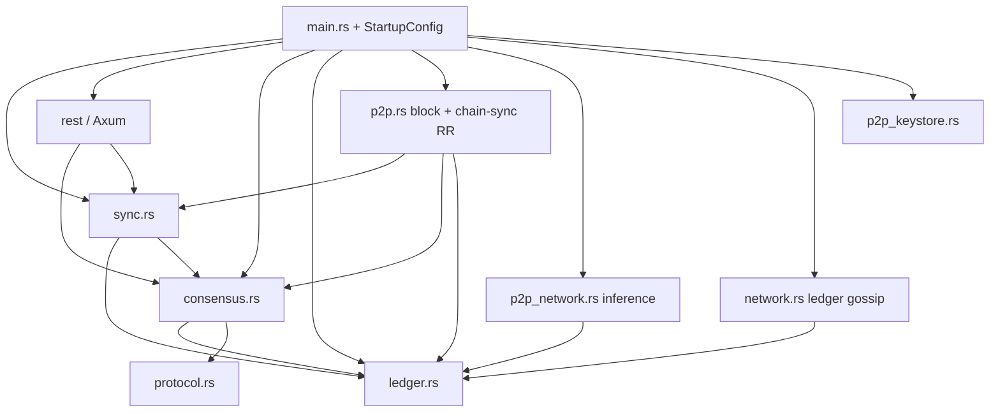

# TET Network — Codebase Overview (v2)

**Version:** v2 (post–Sprint 1)  
**作成日:** 2026-05-19  
**前版:** [`archive/CODEBASE_OVERVIEW_v1_pre_sprint1.md`](archive/CODEBASE_OVERVIEW_v1_pre_sprint1.md)（2026-05-18、Sprint 1 開始前）  
**対象リポジトリ:** `/Users/sengokukazuma/Nexus_Network`  
**Sprint 1 参照コミット（報告値）:** `7264191`（catch-up driver）、`499bb00`（sync gate + startup）、`183fd14`（Phase C 統合テスト）— **未検証: ローカルで `git log` 未実行**

**読者:** Founder-Architect / シニアエンジニア向けオンボーディング  
**方法:** コード変更なし。列挙ファイルを実読（2026-05-19）。

---

## 0. ホワイトペーパー正本

**正本:** [`WHITEPAPER.md`](../WHITEPAPER.md) / [`GENESIS_V1.md`](../GENESIS_V1.md) — **Genesis Draft v1.0**（2026-04-28、§1–§17）。

| 章 | 内容 |
|----|------|
| §4 | CAAC — §4.1 PoC, §4.2 PoR |
| §5 | Fluid chain — §5.1 Sovereign Runtime (+ challenge window → ZK-Court), §5.2 R(T) / Sovereign Peg |
| §6 | Fluid transaction `workload_flag` |
| §7–§8 | Weight locality, edge light clients |
| §9 | Thermodynamic efficiency, Cockroach Doctrine |
| §10 | ML-DSA (FIPS 204) |
| §11 | Tokenomics (10B cap, 25/50/25 allocation, 50% fee burn) |
| §12.1–12.4 | Binding Phase 0/1 applications |
| §12.5–12.7 | **Future Work**（本文で明示） |
| §13–§14 | Roadmap, threat model (§14.1 ZK fraud, §14.2 hardware fingerprinting) |

**Deprecated:** [`archive/WHITEPAPER_v0_economic.md`](../archive/WHITEPAPER_v0_economic.md)

**補助 PDF:** `tet-network/ui/public/tet-network-whitepaper.pdf`（2026-04-28）— MD との diff は **要 Steve 判断**（Phase 0 ship 前に突合推奨）。

---

## 1. リポジトリ構造マップ（depth ≤ 3）

```
Nexus_Network/
├── tet-core/                    [CANONICAL] Rust L1 ノード (TET-Core バイナリ)
│   ├── src/                     メインロジック（sync.rs 新規 + main 604 行）
│   ├── scripts/                 start-network.sh, start-3-node-testnet.sh, print-bootnode.sh
│   ├── Dockerfile, docker-compose.yml
│   └── tests/, examples/
├── tet-network/
│   ├── ui/                      [CANONICAL] Next.js 16 Sovereign OS / Explorer
│   └── chain/                   [ARCHIVED] Substrate テンプレ
├── methods/, prover/            [CANONICAL] RISC0 zkVM / guest
├── nexus-protocol/              [CANONICAL] 共有プロトコル型
├── tet-pqc-wasm/, nexus-wasm/   PQC WASM 補助
├── tet-agent-sdk/               TypeScript M2M クライアント
├── tet-cli/                     CLI（workspace；`TxV1::VerifyZkProof` ビルド不整合あり）
├── docs/                        STATUS, SYNC_ISSUE, SPRINT_PLAN, 本ファイル
├── WHITEPAPER.md                Genesis v1.0 正本
└── Cargo.toml                   workspace
```

| パス | タグ | 一行説明 |
|------|------|----------|
| `tet-core/` | **canonical** | sled 台帳 + Axum REST + libp2p 3 スタック + catch-up + auto-mine gate |
| `tet-network/ui/` | **canonical** | `/os`, `/explorer`, `/worker`, `/whitepaper` |
| `methods/`, `prover/` | **canonical** | RISC0 guest（`RISC0_SKIP_BUILD=1` で ELF スタブ可） |
| `nexus-protocol/` | **canonical** | `ZkCourtJournalV1` 等 |
| `tet-cli/` | active（壊れ気味） | workspace 全体 `cargo test` が失敗し得る |
| *(removed)* `tet-core-node/`, `tet-network/chain/` | **removed** | Substrate experiments (git history) |
| `docs/archive/` | meta | v1 overview 退避 |

**注意:** プロンプトの `nexus-network/` ディレクトリは **存在しない**（同等は `tet-network/`）。

---

## 2. モジュール依存グラフ（tet-core）

`TET-Core` バイナリは `main.rs` が **38 モジュール + `sync`** を直宣言（L3–L43）。`lib.rs` は薄い re-export のみ。

### 2.1 Mermaid（起動・データフロー）



### 2.2 起動順（B.5、`main.rs` 実読）

| Step | 内容 | ログ / 行 |
|------|------|-----------|
| 1 | `StartupConfig::from_env()` | L262–268 `[startup] config loaded` |
| 2 | libp2p keystore (`p2p_keystore`) | L318–334 |
| 2b | ML-DSA node keystore (`tet_core::pqc_keystore`) | L337–343 |
| 3 | Ledger open + genesis/faucet | L345–363 `[startup] ledger opened` |
| 4a | `NetworkManager` (`network.rs`) | L452–472 |
| 4b | `p2p_network::start_p2p_node` | L479–491 |
| 5 | `sync::install_block_sync_board` | L493–502（hello registry + catch-up driver） |
| 4c | `p2p::start_mdns_ping_swarm`（**同一** `TET_P2P_LISTEN` を `parse_block_listen_multiaddr` 経由） | L504–536 |
| — | bootnode dial（各 swarm タスク内） | L538–543 |
| 6 | `serve(RestState)` 準備 | L555–569 |
| 7 | `spawn_auto_miner`（`sync::auto_mine_blocked_by_sync`） | L574–583 |
| 8 | `serve` ブロック | L598+ |

**v1 からの改善:** block-plane は `tcp/0` 専用ではなく `config.p2p_listen`（`TET_P2P_LISTEN`）を使用（`main.rs` L504–518、`p2p.rs` L660, L745）。

**残課題:** 依然 **3 独立 swarms**（`network` / `p2p_network` / `p2p`）。bootnode multiaddr は **block-plane の listen + `/p2p/<id>`** である必要あり（`SYNC_ISSUE.md` §1 は一部 outdated）。

---

## 3. ホワイトペーパー要素 → 実装マッピング（Genesis v1.0）

**実装状況:** `0` 未着手 / `1` スケルトン / `2` 部分 / `3` 単体・統合テストで実証済み

| WP § | 概念 | WHITEPAPER 参照 | 実装ファイル | 状況 | Gap（Sprint 1 後） |
|------|------|-----------------|--------------|------|---------------------|
| §4.1 | PoC | L60–62 | `vision/caac.rs`, `worker_daemon.rs`, `consensus.rs` | **2** | ローカル PoC 判定 + daemon；ネットワーク広域スケジューラ未接続 |
| §4.2 | PoR | L64–66 | `vision/caac.rs`, `p2p.rs` relay/gossip | **2** | 帯域・gossip 参加はあるが PoR 専用報酬経路は薄い |
| §5.1 | Sovereign Runtime + challenge window | L76–80 | `rest/`, `vision/zk_court.rs`, `worker_daemon.rs` | **2** | challenge window 実装あり；本番 zkVM 証明は dev 中心 |
| §5.1 | ZK-Court slash | L78–80 | `vision/zk_court.rs` L64–77, L115+ | **2** | in-memory dispute；100% slash は λ 倍率モデル（WP 文言と要突合） |
| §5.2 | R(T) / Sovereign Peg | L82–88 | `vision/thermo_genesis.rs` L53–78 | **2** | コードは `(C/E)×Γ`；**η(Wᵢ)** 項は未実装（WP 式と不一致） |
| §6 | workload flag | L92–99 | `protocol.rs` | **3** | flag 0/1 + ルーティング拒否テスト |
| §7 | Weight Locality | L101–105 | `consensus.rs` CAAC leader weights | **1–2** | 地理クラスタ未実装 |
| §8 | Light client / Merkle | L109–113 | `ledger.rs` `compute_state_root` | **1** | SPV プロトコル未 |
| §9 | Zero-waste compute | L117–119 | inference 経路 | **2** | PoW パズルなし；AI タスクは実ユーティリティ |
| §10 | ML-DSA genesis | L127–131 | `quantum_shield.rs`, `wallet.rs`, `tet-pqc-wasm/` | **2** | トランザクションは hybrid Ed25519+ML-DSA；ノード補助鍵は別 |
| §11 | 10B cap | L135–137 | `ledger.rs` L35 `MAX_SUPPLY_MICRO` | **3** | `10_000_000_000 * STEVEMON` |
| §11.1 | Genesis 25/50/25 | L139–143 | `ledger.rs` L4045–4046 | **部分** | コードは **25% founder + 75% worker pool**（WP 50% mining / 25% treasury と不一致） |
| §11.2 | 50% fee burn | L145–147 | `ledger.rs` `META_TOTAL_BURNED` | **2** | 一般手数料 burn あり；AI は 80/15/5 別レイヤ |
| §12.2 | AI Inference Marketplace | L161–163 | `p2p_network.rs`, `rest/handlers/enterprise.rs` | **2** | E2EE + settlement + ZK モック |
| §12.5–12.7 | Future Work | L173–177 | — | **0** | 本文で Phase 0/1 対象外 |
| §14.1 | Lazy eval / ZK fraud | L215–217 | `zk_court.rs`, `zk_verifier.rs`, `methods/` | **2** | mock receipt テスト多い |
| §14.2 | Hardware fingerprinting | L219–221 | `vision/caac.rs` L138–195 | **2** | SHA256-chain micro-task；タイミング Sybil 防御は部分 |
| **P2P chain sync** | （WP は分散 L1 一般要件） | — | **`sync.rs`**, `p2p.rs` | **3** | Hello + range pull + driver + gate（Sprint 1） |

---

## 4. tet-core モジュール早見表（Sprint 1 後）

| モジュール | 行数 | 役割 |
|------------|------|------|
| `ledger.rs` | 6427 | sled KV、genesis、burn、CAAC/ZK-Court メタ、CHF（legacy） |
| `sync.rs` | **1261** | **新規** — `ChainHello`, catch-up driver, `BlockSyncBoard`, `/ledger/state` 用 status |
| `p2p.rs` | 1865 | block gossip、`/tet/v1/chain-sync/*` RR、bootnode dial、catch-up apply |
| `consensus.rs` | 1534 | mine、auto-miner + **sync gate**、remote apply |
| `tests.rs` | 3384 | **92** テスト（Phase C `mod block_sync` 含む） |
| `main.rs` | 604 | `StartupConfig`、明示的 `[startup]` 順序 |
| `p2p_network.rs` | 1405 | inference gossip `nexus-inference-v1` |
| `network.rs` | 356 | `/tet/v1/ledger` replication |
| `p2p_keystore.rs` | 76 | `libp2p_keypair.bin` |

**Binaries** (`tet-core/Cargo.toml`): `TET-Core`, `TET-Signer`, `TET-Worker-App`, `solana_pda`。

---

## 5. Sprint 1 完了サマリー（実装）

| マイルストーン | 内容 |
|----------------|------|
| B.3a/b | `sync.rs` + `p2p.rs` — Hello、range request/response、catch-up driver、`apply_remote_block_from_gossip` 経由 apply |
| B.4 | `/ledger/state` に `synced` + `sync`；`auto_mine_blocked_by_sync` |
| B.5 | `main.rs` 起動順序 + `[startup]` ログ；`install_block_sync_board` を REST 前に実行 |
| Phase C | `tests.rs` `mod block_sync` 3 本 + `scripts/start-3-node-testnet.sh` |

**DoD（`docs/SPRINT_PLAN.md`）:** `cargo test --bin TET-Core block_sync` + 3-node `max(height)-min(height) ≤ 2` — **手動スクリプトで PASS 報告**（spread=1）。

---

## 6. 重要な現存バグ・未解決問題

### 6.1 Sprint 1 carry-over（5 項目）

| # | 問題 | 根拠（ファイル:行） |
|---|------|---------------------|
| C1 | **3 libp2p swarms 未統合** | `main.rs` L452–536；`docs/SYNC_ISSUE.md` §1 は block listen の記述が古い |
| C2 | **Gossip tip-only skip 残存** | `consensus.rs` L1326–1331 — `height > local+1` は skip；catch-up は **range apply** で回避 |
| C3 | **`parent_block_id: None` on local mine** | `consensus.rs` L1144, L1256（`record_block_record` 引数） |
| C4 | **`BlockSyncBoard` はプロセス内 `OnceLock` 1 つ** | `sync.rs` L554 — 同一プロセス多ノードテストでは auto-miner gate が共有されない |
| C5 | **`docs/SYNC_ISSUE.md` 未更新** | L17 仍記 `tcp/0`；Sprint 1 完了チェック未反映 |

### 6.2 Sprint 1 / Phase C で新規に見えた点

| 項目 | 根拠 |
|------|------|
| **tip `state_root` が height ±1 で一致しないことがある** | 手動 3-node: n1=11 vs n2/n3=12 で root 差（DoD は height のみ） |
| **follower が死んだ bootnode に張り付いたまま gossip 不足** | Phase C C.2 — Node3 を Node2 bootnode に `respawn_swarm` で回避 |
| **`p2p_network.rs` 先頭コメントが誤り** | L3–4「not wired into main.rs」— 実際 `main.rs` L479–491 で起動 |
| **WP §11.1 25/50/25 vs ledger 25/75** | `WHITEPAPER.md` L139–143 vs `ledger.rs` L4045–4046 |
| **`tet-cli` workspace テスト破損** | v1 同様 — `VerifyZkProof` フィールド不整合 |
| **REORG 未サポート** | `p2p.rs` — 「REORG UNSUPPORTED」ログ（v1 継続、行番号要再 grep） |

### 6.3 grep: TODO / FIXME

`tet-core/src/**/*.rs`: **TODO/FIXME/unimplemented! = 0 件**（v1 同様）。

---

## 7. テストカバレッジ

### 7.1 `cargo test --bin TET-Core`

```text
# 2026-05-19 実行
RISC0_SKIP_BUILD=1 cargo test --bin TET-Core
→ test result: ok. 92 passed; 0 failed
```

| 内訳（概算） | 件数 |
|--------------|------|
| `tests.rs` | ~58 |
| `sync.rs` tests | ~27 |
| `p2p.rs` tests | 3 |
| `invariant_tests.rs` | 3 |
| `chaos.rs` | 1 |

### 7.2 Phase C — `tests.rs` `mod block_sync`

| テスト | 役割 | タイムアウト |
|--------|------|--------------|
| `chain_sync_three_nodes_in_process` | bootstrap height 10 → 2 followers catch-up；spread ≤2；`state_root` 一致；fork なし | 30s |
| `chain_sync_recovers_after_peer_disconnect` | Node1 停止 → Node2 延長 → Node4 参加 → Node1 再合流 | 45s |
| `sync_gate_prevents_fork_under_concurrent_start` | 同時起動 + 単一 producer；canonical `block_id` 一致 | 30s |

**手動:** `tet-core/scripts/start-3-node-testnet.sh` — ports 5010/5020/5030、DoD spread 判定。

### 7.3 カバーが薄い領域

| 領域 | 理由 |
|------|------|
| 本番 TCP 3-node 長時間 soak | CI 未組み込み |
| 3 プロセス各々の sync gate 同時 auto-mine | `OnceLock` 制約 |
| `p2p_network` WebRTC NAT | 統合テスト少 |
| `tet-network/ui` | `package.json` test script なし |
| `RISC0_SKIP_BUILD=0` フル guest | ツールチェーン依存 |

### 7.4 workspace 全体

```text
cargo test --workspace --no-run
→ tet-cli コンパイルエラーの可能性（v1 継続）— 要 Steve 判断で CI 方針
```

---

## 8. Sprint 2 具体タスク（`docs/SPRINT_PLAN.md` + Cursor 再検証）

**`SPRINT_PLAN.md` Sprint 2 との整合:**

| SPRINT_PLAN 項目 | Cursor 視点 | 一致？ |
|------------------|-------------|--------|
| Shared `TET_VALIDATOR_IDS` | **NEEDED** — hash leader で非 leader が mine しない問題が運用で頻出 | ✅ |
| Leader-only auto-mine テスト固定 | **NEEDED** — `auto_miner_*` 拡張 | ✅ |
| `parent_block_id` 整合 | **NEEDED** — carry-over C3 | ✅ |
| `/ledger/state` synced/lag | **完了（B.4）** — `ledger.rs` L888–904；Sprint 2 は **compose 必須化** のみ残る | ✅ 部分 |

**推奨スコープ（carry-over 1–3 + 運用）との対応:**

| 推奨タスク | Sprint 2 への落とし込み |
|------------|-------------------------|
| carry-over 1–3（swarm 統合設計、SYNC_ISSUE 更新、parent） | SPRINT_PLAN 1.1–1.3 + `SYNC_ISSUE.md` メンテ |
| tet-cli 修復 | **SPRINT_PLAN 外** — 別 PR 推奨（workspace CI 復旧） |
| parent_block_id | SPRINT_PLAN 項目 3 |
| 運用 docs（bootnode = block-plane listen） | `README.md`, `scripts/start-3-node-testnet.sh` 注記 |

**Cursor 追加推奨（Sprint 2）:**

1. `docs/SYNC_ISSUE.md` を Sprint 1 完了状態に書き換え（`TET_P2P_LISTEN`、catch-up フロー図）。
2. genesis 配分を WP §11.1 と突合（25/75 vs 25/50/25）— **要 Steve 判断**。
3. 3-node DoD に optional `state_root` 一致条件（同 height 時）。

---

## 9. ファイル別 Whitepaper 整合性 + Sprint 2 判定

### 9.1 優先度 P0

| ファイル | WP 整合 | Sprint 2 | 難易度 | 根拠（引用） |
|----------|---------|----------|--------|--------------|
| `vision/caac.rs` | **部分** | **OPTIONAL** | Med | PoC/PoR: L9–17, L99–105；challenge L138–195；**server wall time は判定に使わない** L173–177 |
| `vision/zk_court.rs` | **部分** | **NEEDED** | Med | §14.1 L215–217；challenge window L64–68；slash λ L71–76；disputes in-memory L87–91 |
| `vision/thermo_genesis.rs` | **部分** | **NEEDED** | Med | §5.2 L82–88 の **η(Wᵢ)** 未実装；コードは L53–78 `(c_flops/e)×Γ` |
| `quantum_shield.rs` | **部分** | **OPTIONAL** | Easy | §10 L127–131；hybrid verify L76+；`pqc_active` prod default L40–41 |
| `pqc_keystore.rs`（crate `tet_core`） | **部分** | **OPTIONAL** | Easy | ノード ML-DSA-65 補助 L15–37；**トランザクション署名とは別系統** |
| `ledger.rs` | **部分** | **NEEDED** | Hard | cap L35；genesis L4045–4046 **25/75** vs WP **25/50/25** L139–143；burn meta L155 |

### 9.2 優先度 P1

| ファイル | WP 整合 | Sprint 2 | 難易度 | 根拠（引用） |
|----------|---------|----------|--------|--------------|
| `p2p_network.rs` | **部分** | **DEFER** | Hard | §12.2 L161–163；`INFERENCE_TOPIC` L41；**モジュールコメント L3–4 は誤り** |
| `worker_daemon.rs` | **部分** | **OPTIONAL** | Med | §4.1 PoC L60–62；POC gate L65–73；`NEXUS_GUEST_ELF` L49–52 |
| `rest/handlers/enterprise.rs` | **部分** | **OPTIONAL** | Med | §12.2；80/15/5 settlement L212–217（WP §11.2 50% burn とは別レイヤ） |
| `methods/` + `prover/` | **部分** | **DEFER**（Sprint 3） | Hard | `methods/Cargo.toml` RISC0 3.0.5；Sprint 3 で `RISC0_SKIP_BUILD=0` CI |

### 9.3 優先度 P2（Phase 0 外）

| パス | WP 整合 | Sprint 2 | 備考 |
|------|---------|----------|------|
| `nexus-protocol/` | **部分** | **DEFER** | `ZkCourtJournalV1` 等 — tet-core と同期維持 |
| `tet-pqc-wasm/` | **部分** | **DEFER** | ブラウザ署名 — UI 連携 |
| `tet-network/ui/app/*` | **部分** | **DEFER** | REST 5010 前提；`/whitepaper` ルートあり |

---

## 10. tet-network/ui（要約）

| 項目 | 内容 |
|------|------|
| スタック | Next.js 16, React 19 |
| ルート | `app/os/`, `app/explorer/`, `app/worker/`, `app/whitepaper/` |
| API | `TET-Core` REST；`/ledger/state` の `synced` は Sprint 1 で追加 |
| Phase 0 | `tet-network/ui/README.md` — `TET_AUTO_MINE`, mock ZK |

---

## 11. ホワイトペーパー v1.1 改稿時に明確化すべき箇所（Sprint 1 実装後）

1. **Genesis 配分表** — WP §11.1（25/50/25）と `ledger.rs` `apply_genesis_allocation`（25% founder + 75% `WALLET_SYSTEM_WORKER_POOL`、L4045–4046）の **どちらが正**か。

2. **§5.2 R(T) 実装式** — WP の η(Wᵢ)·C(tᵢ)/D(t) と `thermo_genesis.rs` の `(c_flops/e_joules_per_flop)×Γ`（L53–78）の **記号対応表**。

3. **AI 経済 80/15/5 vs §11.2 50% burn** — `enterprise.rs` L212–217 と fee burn の **適用順序・対象トランザクション**。

4. **分散 testnet 拓扑** — 3 swarms / 3 ports の **本番要件**（dev convenience か production か）。

5. **Block sync プロトコル** — `/tet/v1/chain-sync/hello|range/json`（`sync.rs` L14–17）を normative にするか Appendix 化するか。

6. **Bootnode multiaddr** — block-plane `listening on .../p2p/<id>` を運用必須と明記（keystore バナーと不一致し得る）。

7. **Sync readiness** — `synced` / `lag_blocks` の定義（`sync.rs` `compute_ledger_sync_status*`）を REST 仕様として固定。

8. **ML-DSA スコープ** — §10「base-layer from genesis」と **hybrid Ed25519+ML-DSA トランザクション** + **ノード補助 ML-DSA-65**（`pqc_keystore.rs`）の関係。

9. **Catch-up vs gossip** — tip-only apply skip が残る理由と range catch-up の **normative パス**（`consensus.rs` L1326–1331）。

10. **§14.2 probabilistic fingerprinting** — `caac.rs` SHA256-chain challenge（L138–195）が WP の「timing signature」主張を満たすか、または claim を弱めるか。

---

## 12. 読了ログ

| # | ファイル | 状態 |
|---|----------|------|
| 1 | `WHITEPAPER.md` | ✅ 構造 + §4–§14 精読 |
| 2 | `docs/archive/CODEBASE_OVERVIEW_v1_pre_sprint1.md` | ✅ |
| 3 | `docs/SPRINT_PLAN.md` | ✅ Sprint 1–2 |
| 4 | `docs/SYNC_ISSUE.md` | ✅（**内容は Sprint 1 前のまま**） |
| 5 | `tet-core/src/sync.rs` | ✅ 先頭 + tests 構成 |
| 6 | `tet-core/src/main.rs` | ✅ 起動順 L262–598 |
| 7 | `tet-core/src/p2p.rs`, `consensus.rs` | ✅ catch-up + skip 条件 |
| 8 | P0/P1 整合性ファイル | ✅ 上表引用行 |
| 9 | `tests.rs` `mod block_sync` | ✅ |
| 10 | `scripts/start-3-node-testnet.sh` | ✅ 実行ログ参照 |

---

## 13. 関連ドキュメント

- [`archive/CODEBASE_OVERVIEW_v1_pre_sprint1.md`](archive/CODEBASE_OVERVIEW_v1_pre_sprint1.md)
- [`STATUS.md`](./STATUS.md)
- [`SYNC_ISSUE.md`](./SYNC_ISSUE.md) — **要 Sprint 2 更新**
- [`SPRINT_PLAN.md`](./SPRINT_PLAN.md)
- [`../WHITEPAPER.md`](../WHITEPAPER.md)

---

*本ドキュメントはコード変更を伴わない。次の実装は `docs/SPRINT_PLAN.md` Sprint 2 と `SYNC_ISSUE.md` 更新を推奨。*
