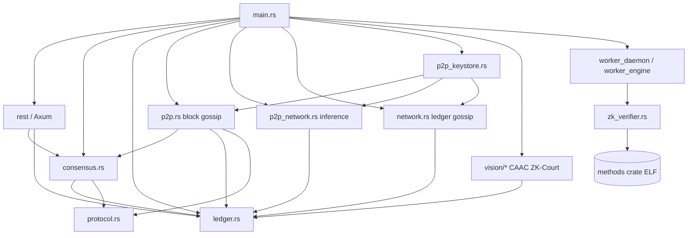

# TET Network — Codebase Overview

**作成日:** 2026-05-18  
**対象リポジトリ:** `/Users/sengokukazuma/Nexus_Network`（旧 Nexus Network）  
**読者:** Founder-Architect / シニアエンジニア向けオンボーディング  
**方法:** コード変更なし。列挙ファイルを実読。

---

## 0. ホワイトペーパー正本（2026-05-18 更新）

**正本:** [`WHITEPAPER.md`](../WHITEPAPER.md) / [`GENESIS_V1.md`](../GENESIS_V1.md) — **Genesis Draft v1.0**（2026-04-28、§1–§17、~287 行）。

| 章 | 内容 |
|----|------|
| §4 | CAAC — §4.1 PoC, §4.2 PoR |
| §5 | Fluid chain — §5.1 Sovereign Runtime (+ challenge window → ZK-Court), §5.2 R(T) / Sovereign Peg |
| §6 | Fluid transaction workload flag |
| §7–§8 | Weight Locality, edge light clients |
| §9 | Thermodynamic efficiency, Cockroach Doctrine |
| §10 | ML-DSA (FIPS 204) |
| §11 | Tokenomics (10B cap, 25/50/25, 50% fee burn) |
| §12.1–12.4 | Binding applications; **§12.5–12.7 = Future Work** |
| §13–§14 | Roadmap, threat model (§14.2 hardware fingerprinting) |

**Deprecated:** [`archive/WHITEPAPER_v0_economic.md`](../archive/WHITEPAPER_v0_economic.md)（CHF peg / stevemon / Imperial Tax / Sharding Plugins）。

**補助:** `tet-network/ui/public/tet-network-whitepaper.pdf`（2026-04-28、~1.8 MB）— 本文 diff は Phase 0 ship 直前（[`WHITEPAPER_V1.0_LAUNCH.md`](WHITEPAPER_V1.0_LAUNCH.md)）。

---

## 1. リポジトリ構造マップ（depth ≤ 3）

```
Nexus_Network/
├── tet-core/                    [CANONICAL] Rust L1 ノード (TET-Core バイナリ)
│   ├── src/                     メインロジック (~15k LOC 中核)
│   ├── scripts/                 start-network.sh, print-bootnode.sh
│   ├── Dockerfile, docker-compose.yml
│   └── tests/, examples/
├── tet-network/
│   ├── ui/                      [CANONICAL] Next.js 16 Sovereign OS / Explorer
│   └── chain/                   [ARCHIVED] Substrate テンプレ実験
├── methods/, prover/            [CANONICAL] RISC0 zkVM / guest
├── nexus-protocol/              [CANONICAL] 共有プロトコル型 (chain-bound payload)
├── tet-pqc-wasm/, nexus-wasm/   PQC WASM 補助
├── tet-agent-sdk/               TypeScript M2M クライアント
├── tet-cli/                     CLI（workspace メンバー、現状テストビルド失敗あり）
├── docs/                        STATUS, SYNC_ISSUE, SPRINT_PLAN, 本ファイル
├── tet-core-node/               [ARCHIVED] Substrate node 実験
├── nexus-onchain/               [ARCHIVED] Solana Anchor 実験
├── nexus network/               [ARCHIVED] レガシー入れ子 (tet-core-node, tet-ui)
├── observability/               Prometheus/Grafana 雛形
├── deploy/, web-wallet/, pwa/   運用・フロント実験
├── WHITEPAPER.md, LITEPAPER.md  ルート正本（経済・計算ビジョン）
└── Cargo.toml                   workspace: tet-core, methods, prover, tet-cli, ...
```

| パス | タグ | 一行説明 |
|------|------|----------|
| `tet-core/` | **canonical** | sled 台帳 + Axum REST + libp2p 3 スタック + consensus/auto-mine |
| `tet-network/ui/` | **canonical** | `/os`, `/explorer`, `/worker` 等の Next.js UI |
| `methods/`, `prover/` | **canonical** | RISC0 guest / prover host |
| `nexus-protocol/` | **canonical** | `TxV1` 等と整合する共有スキーマ |
| `tet-agent-sdk/` | active | HTTP クライアント + ZK-Court 監査テスト例 |
| `tet-pqc-wasm/` | active | ML-DSA WASM |
| `tet-cli/` | active (壊れ気味) | 運用 CLI |
| `tet-core-node/`, `tet-network/chain/` | **archived** | Substrate；CI `if: false` |
| `nexus-onchain/` | **archived** | Solana プログラム実験 |
| `nexus network/` | **archived** | 旧ディレクトリ構造 |
| `observability/` | auxiliary | 監視ダッシュボード素材 |
| `docs/` | meta | ギャップ分析・同期診断・スプリント計画 |

**注意:** プロンプトの `nexus-network/` は **存在しない**。同等は `tet-network/`。

**存在しないファイル（プロンプト記載 → 実体）:**

| 期待名 | 実体 |
|--------|------|
| `block.rs` | **UNKNOWN** — ブロック型は `consensus.rs` / `ledger.rs` 内 |
| `tx.rs` | `protocol.rs`（`TxV1` enum） |
| `signature.rs` / `pqc.rs` | `quantum_shield.rs`, `wallet.rs`, `pqc_keystore.rs` |
| `api.rs` | `rest.rs` + `rest/routes.rs` + `rest/handlers/*` |
| `lib.rs`（フルツリー） | `tet-core/src/lib.rs` は **14 行**の部分 re-export のみ；**バイナリは `main.rs` が全モジュールを宣言** |

---

## 2. モジュール依存グラフ（tet-core）

`TET-Core` バイナリは **library crate としては薄く**、`main.rs` が 37 モジュールを直宣言（L3–L37）。

### 2.1 Mermaid（起動・データフロー）



### 2.2 ASCII（依存の要点）

```
main.rs
  ├─► ledger.rs ◄──────────────────────────────────┐
  ├─► consensus.rs ──► protocol.rs                 │
  ├─► rest/ ──► handlers/* ──► consensus, ledger   │
  ├─► p2p_keystore.rs                              │
  │     ├─► network.rs (topic /tet/v1/ledger)      │
  │     ├─► p2p_network.rs (topic nexus-inference-v1)
  │     └─► p2p.rs (topics /tet/v1/blocks|txs)     │
  ├─► replication.rs ◄── network publish           │
  ├─► vision/{caac,zk_court,thermo_genesis,...}    │
  ├─► worker_daemon.rs ──► zk_verifier ──► methods
  └─► serve(RestState) ────────────────────────────┘
```

**起動順（引用）:** `main.rs` L374–387 keystore → L389–408 `NetworkManager` → L417–426 `p2p_network::start_p2p_node` → L432–441 `p2p::start_mdns_ping_swarm` → L478–482 `spawn_auto_miner` → L501 `serve`.

---

## 3. ホワイトペーパー要素 → 実装マッピング

**実装状況:** `0` 未着手 / `1` スケルトン / `2` 部分 / `3` 完全（単体ノード + テスト基準）

| WP § | 概念 | WHITEPAPER 参照 | 実装ファイル | 状況 | Gap |
|------|------|-----------------|--------------|------|-----|
| §4.1 | PoC | L60–62 | `vision/caac.rs`, `consensus.rs`, `worker_daemon.rs` | **2** | 本番スケジューラ未接続 |
| §4.2 | PoR | L64–66 | `vision/caac.rs`, `p2p.rs` | **2** | 帯域ガード・coinbase-only mining まで |
| §5.1 | Sovereign Runtime + optimistic window | L76–80 | `main.rs`, `rest/`, `tet-network/ui/app/os/` | **2** | window 長・watcher 報酬未定義（v1.1 Gap 3） |
| §5.1 | ZK-Court | L78–80 | `vision/zk_court.rs`, `methods/`, `zk_verifier.rs` | **2** | dispute フル E2E・本番証明は未 |
| §5.2 | R(T) / Sovereign Peg | L82–88 | `vision/thermo_genesis.rs`, `consensus.rs` | **2** | η(Wᵢ) 未実装；コード式は flops/joules×Γ |
| §6 | workload flag | L92–99 | `protocol.rs` | **3** | `EnterpriseInference.workload_flag` + テスト |
| §7 | Weight Locality | L101–105 | `consensus.rs` CAAC weights | **1–2** | 地理クラスタリング未実装 |
| §8 | Light client / Merkle | L109–113 | `ledger.rs` `compute_state_root` | **1** | SPV プロトコル未 |
| §10 | ML-DSA | L127–131 | `quantum_shield.rs`, `tet-pqc-wasm/` | **2** | 監査レベル検証は SPRINT0 GAP |
| §11 | Tokenomics cap / allocation | L135–143 | `ledger.rs` `MAX_SUPPLY_MICRO` | **3** | 10B cap；配分は genesis 設計と要突合 |
| §11.2 | 50% fee burn | L145–147 | `ledger.rs` burn meta, fee split | **2** | 80/15/5 AI settlement は別レイヤ（Gap 6） |
| §12.5–12.7 | Future Work apps | L173–199 | — | **0** | 本文で Phase 0/1 対象外と明記 |
| §14.1 | Lazy evaluation / ZK-Court | L215–217 | `vision/zk_court.rs`, `tests.rs` | **2** | mock テストあり |
| §14.2 | Hardware fingerprinting | L219–221 | `vision/caac.rs` | **2** | probabilistic micro-tasks 未実装 |

---

## 4. tet-core モジュール早見表

| モジュール | 行数(概算) | 役割 |
|------------|------------|------|
| `ledger.rs` | 6427 | sled KV、残高、手数料、genesis、CAAC/ZK-Court メタ、CHF mint |
| `consensus.rs` | 1522 | mine、auto-miner、remote block apply、validator/leader |
| `p2p_network.rs` | 1405 | inference gossip、Kademlia、WebRTC、worker stake gate |
| `p2p.rs` | 1344 | **block** gossip `/tet/v1/blocks`、block-sync RPC、mdns |
| `tests.rs` | 3069 | **~50+** 統合テスト（in-process） |
| `main.rs` | 503 | 起動、P2P 配線、prod guard |
| `network.rs` | 356 | `/tet/v1/ledger` replication gossip |
| `protocol.rs` | 124 | `TxV1`, `SignedTxEnvelopeV1` |
| `worker_daemon.rs` | 368 | POC 自動 inference → `VerifyZkProof` |
| `p2p_keystore.rs` | 76 | `libp2p_keypair.bin` 永続化 |

**Binaries** (`tet-core/Cargo.toml` L73–83): `TET-Core`, `TET-Signer`, `TET-Worker-App`, `solana_pda`.

---

## 5. 重要な現存バグ・未解決問題

### 5.1 `docs/SYNC_ISSUE.md` 要約

| # | 問題 |
|---|------|
| 1 | **3 つの libp2p スワーム** — ブロック gossip は `p2p.rs` の **ephemeral `tcp/0`** のみ（`main.rs` L430–431） |
| 2 | **tip-only gossip** — `apply_remote_block_from_gossip` は `height > local+1` を skip（`consensus.rs` L1314–1319） |
| 3 | **起動遅れのピア** — height 0 のノードは height 15 のブロックを受けても適用不可 |
| 4 | **bootnode :5011** — `TET_P2P_LISTEN` は inference/ledger 用；block mesh とは別ポート |
| 5 | **観測** — PING/mdns は成功しても `block_height` は 15/0/0 のまま |

### 5.2 追加発見

| 項目 | 根拠 |
|------|------|
| `record_block_record` で `parent_block_id: None` を渡す箇所 | `consensus.rs` L1244（mine 時）— gossip では `parent_block_id_for_height` を使用（L1262–1264） |
| `ForkLost` / reorg 未完了 | `p2p.rs` L1033 — 「REORG UNSUPPORTED」ログ |
| genesis snapshot race | `ledger.rs` L4247 — 並列起動で `atomic_write_snapshot` panic 報告あり（3 ノード同時起動） |
| `tet-cli` workspace テスト破損 | `cargo test --workspace --no-run` → `tet-cli` `TxV1::VerifyZkProof` に `task_id` 不足 |
| README と実装の env 名 | README: `TET_BOOTNODES`；古い記述に `TET_BOOTSTRAP_PEERS` なし（整合済み） |

### 5.3 grep: TODO / FIXME / unimplemented!

| パターン | `tet-core/src/**/*.rs` 結果 |
|----------|----------------------------|
| `TODO` | **0 件** |
| `FIXME` | **0 件** |
| `unimplemented!` | **0 件** |
| `panic!` | **本番ガード + genesis 厳格化 + テスト assert**（下表） |

**本番系 `panic!`（抜粋）:**

| ファイル | 行 | 内容 |
|----------|-----|------|
| `main.rs` | 217 | prod で `NEXUS_GUEST_ID == 0` 拒否 |
| `main.rs` | 231, 238 | mainnet で mock ZK / founder 必須 |
| `ledger.rs` | 4206–4247 | genesis 失敗時 FATAL |
| `zk_verifier.rs` | 28 | mainnet + mock ZK 禁止 |
| `e2ee.rs` | 58, 73 | prod で dev E2EE キー禁止 |

**修正済み（参考）:** `worker_daemon.rs` L54–63 — 空 `NEXUS_GUEST_ELF` で warn + return false（旧 CRITICAL panic 撤去）。

---

## 6. テストカバレッジ

### 6.1 `cargo test --workspace --no-run`

```text
# 2026-05-18 実行
cd Nexus_Network && RISC0_SKIP_BUILD=1 cargo test --workspace --no-run
→ FAILED: tet-cli E0063 missing field `task_id` in TxV1::VerifyZkProof
```

**workspace members** (`Cargo.toml` L2–11): `tet-core`, `methods`, `nexus-wasm`, `nexus-protocol`, `tet-pqc-wasm`, `prover/*`, `tet-cli`.

### 6.2 `cargo test -p tet-core --no-run`（成功）

| テスト実行ファイル | ソース |
|--------------------|--------|
| `TET_Core-*.exe` (main) | `src/main.rs` + `tests.rs` |
| `tet_core-*.exe` (lib) | `src/lib.rs`（小） |
| `TET_Signer-*.exe` | `bin/tet-signer.rs` |
| `TET_Worker_App-*.exe` | `bin/tet-worker.rs` |
| `solana_pda-*.exe` | `bin/solana_pda.rs` |

**`tests.rs`:** 先頭付近に **50件以上**の `#[tokio::test]` / `#[test]`（grep 関数定義 ~65、うちヘルパー含む）。

**カバーが厚い領域:** consensus remote block、CAAC leader、ZK verify、reorg/backfill、CHF AML、worker daemon mock。

**カバーが薄い / 無い領域:**

| 領域 | 理由 |
|------|------|
| ライブ 3 ノード TCP E2E | 手動のみ；CI なし |
| `p2p_network` inference ループ | 統合テスト少 |
| `network.rs` ledger gossip | 主に手動 |
| UI (`tet-network/ui`) | `package.json` に test script なし |
| `invariant_tests.rs` | モジュール宣言あり（`main.rs` L11）— 専用テスト関数は **要別途確認** |

---

## 7. Sprint 1 具体タスク（`docs/SPRINT_PLAN.md` より）

**目標:** pull-based catch-up + 3 ノード `block_height` ±2。

| # | タスク | 変更ファイル | 新規 | テスト | 工数 | 難易度 |
|---|--------|--------------|------|--------|------|--------|
| 1.1 | **単一 libp2p スワーム設計** — listen を `TET_P2P_LISTEN` に統一；inference はサブトピック化 | `main.rs`, `p2p.rs`, `p2p_network.rs`, `network.rs` | `docs/` 設計メモ可 | — | 16–24h | **Hard** |
| 1.2 | **Chain sync ループ** — peer `height` 交換後 `[local+1..peer]` を `block-sync` で取得し順次 `apply_remote_block_from_gossip` | `p2p.rs`, 新規 `sync.rs` 候補 | `tet-core/src/sync.rs`（候補） | `tests.rs` `catch_up_*` | 20–28h | **Hard** |
| 1.3 | **起動時 sync gate** — catch-up 完了まで `synced=false` | `consensus.rs`, `rest/handlers/ledger.rs` | — | REST assert | 6–8h | Med |
| 1.4 | **構造化ログ** — skip reason を `WARN` + metric | `consensus.rs`, `metrics.rs` | — | — | 4h | Easy |
| 1.5 | **統合テスト** — in-process 2 node で height 追従 | `tests.rs` | — | `cargo test block_sync` | 8–12h | Med |
| 1.6 | **手動 3-node 手順** — README / `start-network.sh` と DoD 一致 | `scripts/start-network.sh`, `docker-compose.yml` | — | curl 3 ports | 4h | Easy |
| 1.7 | **`SYNC_ISSUE.md` 更新** — Phase A/B 完了チェック | `docs/SYNC_ISSUE.md` | — | — | 2h | Easy |

**合計見積:** 約 **60–82h**（1 FTE 週の 1.5–2 倍 — リスク込みで現実的）。

**完了判定（SPRINT_PLAN 引用）:**

```bash
RISC0_SKIP_BUILD=1 cargo test --bin TET-Core block_sync
for p in 5010 5020 5030; do curl -sf http://127.0.0.1:$p/ledger/state | jq -r .block_height; done
# max-min <= 2
```

---

## 8. tet-network/ui（要約）

| 項目 | 内容 |
|------|------|
| スタック | Next.js 16, React 19 (`package.json` L15–17) |
| 主要ルート | `app/page.tsx`, `app/os/page.tsx`, `app/explorer/*`, `app/worker/page.tsx`, `app/whitepaper/page.tsx` |
| API 向き | `TET-Core` REST（デフォルト 5010） |
| Dockerfile | `tet-network/ui/Dockerfile`（compose から build） |
| Phase 0 手順 | `tet-network/ui/README.md` — `TET_AUTO_MINE`, `TET_ALLOW_MOCK_ZK`, worker daemon |

---

## 9. ホワイトペーパー側で明確化すべき箇所（査読メモ）

Manu Sheel Gupta レベルの第三者が突くであろう **技術的疑問**（コード読了ベース）:

1. **η(Wᵢ) と thermo_genesis** — §5.2 R(T)（`WHITEPAPER.md` L82–88）と `thermo_genesis.rs` の flops/joules 式の対応（[`WHITEPAPER_V1.1_GAPS.md`](WHITEPAPER_V1.1_GAPS.md) Gap 1）。

2. **PoC vs PoR の判定責任** — `caac.rs` L173 は server wall time を PoC/PoR 判定に使わないと明記。クライアント申告 latency の信頼モデルは？

3. **単一マシン上の「分散」** — 3 プロセス × 3 swarms は分散 testnet か、それとも dev convenience か。本番拓扑要件は？

4. **Legacy CHF mint** — Genesis 正本に CHF peg なし。`ledger.rs` `chf_top_up_mint` は deprecated 経路として文書化するか（**要 Steve 判断**）。

5. **ML-DSA mainnet 基準** — §10 と `quantum_shield.rs` の検証強度。mainnet 判定基準は？

6. **§11 vs 80/15/5 AI settlement** — WP §11.2 は 50% fee burn；`enterprise.rs` は 80/15/5。一本の tokenomics 表がない（Gap 6）。

7. **Supply cap と動的 burn** — `MAX_SUPPLY_MICRO` は固定；`META_TOTAL_BURNED` 更新が cap 計算にどう効くか WP に閉式がない。

8. **Light client 非存在** — モバイルウォレット・Agent は full node 前提か。SPV ロードマップは？

9. **Agent-Gate / state channels** — ロードマップに無いのに対外ピッチで出すなら scope creep リスク。

10. **`tet-network-whitepaper.pdf` と repo MD の関係** — PDF のみに載る主張の実装義務は？

---

## 10. 読了ログ（必須ファイル）

| # | ファイル | 状態 |
|---|----------|------|
| 1 | `WHITEPAPER.md` | ✅ 全文（Genesis v1.0, ~287 行） |
| 2 | `archive/LITEPAPER_v0.md` | ✅ deprecated |
| 3 | `README.md` | ✅ |
| 4 | `docs/STATUS.md`, `SYNC_ISSUE.md`, `SPRINT_PLAN.md` | ✅ |
| 5 | `tet-core/README.md` | ✅ 一部（L1–100+） |
| 6 | `tet-core/Cargo.toml` | ✅ |
| 7 | `tet-core/src/main.rs` | ✅ 全文 503 行 |
| 8 | `tet-core/src/lib.rs` | ✅ 14 行（部分 crate） |
| 9 | `tet-core/src/*.rs` | ✅ 中核 10 ファイル精読 + 全 .rs 一覧（~40+ ユニークモジュール） |
| 10 | `tet-core/scripts/*` | ✅ 3 ファイル |
| 11 | Docker / compose | ✅ パス確認 |
| 12 | `tet-network/ui` | ✅ README, package.json, app ルート一覧 |
| 13 | archived | ✅ タグ付けのみ（深読なし） |

---

## 11. 関連ドキュメント

- [`STATUS.md`](./STATUS.md) — コンポーネント別ステータス（絵文字版）
- [`SYNC_ISSUE.md`](./SYNC_ISSUE.md) — ブロック同期根本原因
- [`SPRINT_PLAN.md`](./SPRINT_PLAN.md) — 6 週間ロードマップ
- [`../SPRINT0_ISSUES.md`](../SPRINT0_ISSUES.md) — 公開 testnet GAP バックログ

---

*本ドキュメントはコード変更を伴わない。実装開始時は `docs/SYNC_ISSUE.md` Sprint 1 を最優先とすること。*
