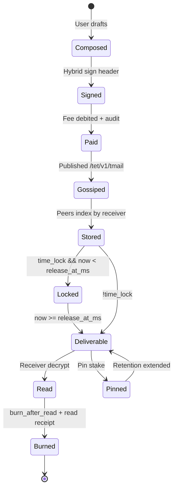
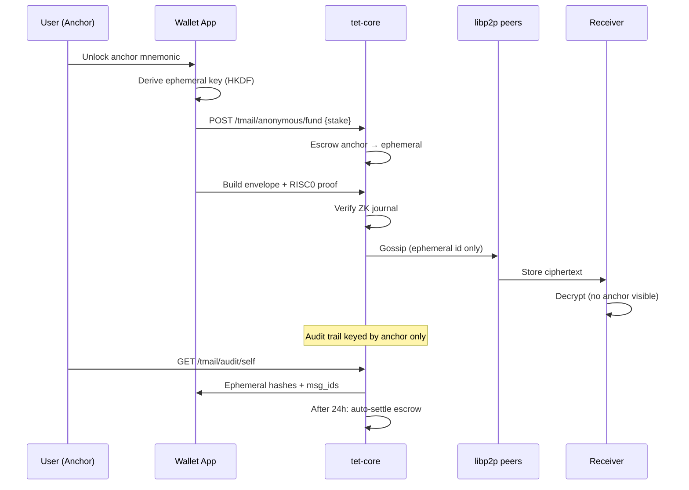

# Sovereign OS — Phase 0 Full Specification

**Version:** 0.3 (Steve decisions locked)  
**Date:** 2026-05-19  
**Status:** Design-only — **no code changes**, **no git commit**  
**Authority:** Steve final direction (quality > calendar; AI Worker → Phase 0.5)  
**WP sync:** [`WHITEPAPER_v1.1_DRAFT.md`](./WHITEPAPER_v1.1_DRAFT.md) §13, §11.5, §17.8–17.9, §18–§19 (v0.3)

**Companion docs (must stay consistent):**

| Doc | Role |
|-----|------|
| [`DESIGN_SOVEREIGN_OS_SUITE.md`](./DESIGN_SOVEREIGN_OS_SUITE.md) | Prior libp2p / Messages-lite analysis — **superseded for scope** by this spec where they conflict |
| [`WORKER_MODE_AUDIT.md`](./WORKER_MODE_AUDIT.md) | AI Worker **not** Phase 0 |
| [`AUDIT_WORKER_REGISTER_AND_STAKE.md`](./AUDIT_WORKER_REGISTER_AND_STAKE.md) | Stake/register — Phase 0.5 |
| [`CODEBASE_ATLAS.md`](./CODEBASE_ATLAS.md) | Module map |
| [`WHITEPAPER_v1.1_DRAFT.md`](./WHITEPAPER_v1.1_DRAFT.md) | **Synced v0.3** — Sovereign OS in Part I §13; Part C below is historical merge notes |

**Length note:** Dense technical spec (~40–50 printed pages at 11pt if appendices included). Steve reviews section-by-section; numbering is stable for comments.

---

# 0. Executive lock-in

## 0.1 Phase 0 product definition

**Sovereign OS** is a **Win95-style desktop shell** (98.css) hosting first-party apps:

| App | Phase 0 scope |
|-----|----------------|
| **Wallet** | Send Coins, hybrid Ed25519 + ML-DSA (`wallet.rs`, UI `transfer.ts`) |
| **Tmail** | Full v1: Basic E2EE, Time-lock, Burn-after-read, Anonymous sender, 5-msg + Pin |
| **Files** | Local mailbox, libp2p P2P transfer, µTET-paid replication |
| **Explorer** | Block/tx browse (existing tab → Win95 window) |
| **Notes** | Encrypted local notes (mini-app) |
| **Calculator** | With TET/USD/JPY (mini-app) |
| **Clock** | Block height + crypto timezones (mini-app) |
| **Worker** | **Hidden** — Start menu 非表示；`SHOW_WORKER_TAB=true` で dev 有効化 — Phase 0.5 product ([`WORKER_MODE_AUDIT.md`](./WORKER_MODE_AUDIT.md)) |

**Anonymous Mode** is **first-class**, not a demo flag: anchor + ephemeral identities + ZK ownership proof + anchor-only audit trail.

## 0.2 Non-goals (Phase 0)

- AI inference worker earn path (Phase 0.5)
- Third-party Win95 apps / Mini-app SDK marketplace (Phase 1+)
- True VDF time-lock **as sole mechanism** (see §A.2 — hybrid schedule + research track)
- Mathematically guaranteed global burn (see §A.3 — protocol burn + honest limits)
- Browser-as-libp2p-peer (UI talks to **user’s tet-core** only)

## 0.3 Codebase starting point (2026-05-19)

| Asset | Location | Reuse for Sovereign OS |
|-------|----------|------------------------|
| E2EE | `tet-core/src/e2ee.rs` | Tmail body encryption (X25519 + ML-KEM + ChaCha20-Poly1305) |
| Hybrid auth | `tet-core/src/wallet.rs` | Tmail / Files / Anonymous envelopes |
| ZK guest | `methods/`, `vision/zk_court.rs` | Anonymous ownership proof guest (new journal type) |
| Block P2P | `tet-core/src/p2p.rs` | `/tet/v1/tmail`, `/tet/v1/files-meta`, RR `/tet/v1/files/chunk` |
| Gossip bridge | `RestState.gossip_tx` `rest/state.rs:45` | Publish Tmail/Files events |
| UI wallet | `tet-network/ui/app/os/OsClient.tsx` | **Replace** tab shell with Win95 WM |
| Inbox (transfers) | `useIncomingMessages.ts` | Subsumed into Wallet notifications or Tmail “Payments” folder |

**Gap:** No `98.css` in `package.json` today — add dependency in implementation **Sprint 6** (Win95 shell).

## 0.4 Ship date (locked)

| Target | Calendar | Rationale |
|--------|----------|-----------|
| **L1 Foundation ready** | **End of Sprint 4** | Public seed + faucet + `docker compose up` (node + UI) before Tmail |
| **Feature freeze** | **2026-08-31** | End of August — Sovereign OS feature-complete |
| **Polish window** | **2026-09-01 – 2026-09-14** | 2 weeks QA / UX / docs |
| **Public Phase 0 ship** | **2026-09-15** | **Target date** (Steve #5) |
| **Not** | 2026-06-30 | Incompatible with L1 Foundation + full Tmail + Anonymous + Win95 |

**Total engineering:** **14–18 weeks** from Sprint 4 start (§B.1).

## 0.5 Final decisions (Steve, 2026-05-19)

| # | Topic | **Locked decision** |
|---|--------|---------------------|
| 1 | Time-lock | **Stake-scheduled** in Phase 0; **VDF** in Phase 0.1 |
| 2 | Burn UI | *"Best-effort burn. Cooperating nodes will purge after read receipt. Non-cooperating peers may retain encrypted copies."* |
| 3 | Anonymous escrow | **1 TET** (1M Stevemon) |
| 4 | Desktop UI legal | **"Inspired by 1990s desktop OS"** — no Microsoft trademarks or trade dress claims |
| 5 | Ship date | **2026-09-15** (freeze **2026-08-31** + 2 wk polish) |
| 6 | World-first marketing | **AT-3, AT-4, AT-5** must all pass before public claims |
| 7 | Worker tab | **Hidden**; `SHOW_WORKER_TAB=true` enables dev access |
| 8 | Docker | **Mandatory** for general users — **node + UI** via `docker compose up` |
| 9 | Sprint 4 | **L1 Foundation** (gates Tmail) |
| 10 | Faucet | **100 TET / day / IP** (rate-limited) |
| 11 | Public seed | **1 node** pre-ship (Hetzner EU, ~$5/mo); **2nd node** post-ship if traffic — SPOF accepted |
| 12 | Docker scope | **tet-core + Sovereign OS UI** in one compose stack |

Canonical checklist: **Appendix V**.

---

# Part A — Technical design

## A.1 Tmail protocol — unified envelope

### A.1.1 Design principles

1. **One envelope type** `TmailEnvelopeV1` with `flags` — avoids four parallel protocols.
2. **Ciphertext never on ledger** — only `payload_sha256`, fees, schedule metadata ([`DESIGN_SOVEREIGN_OS_SUITE.md`](./DESIGN_SOVEREIGN_OS_SUITE.md) §D).
3. **Gossip topic:** `/tet/v1/tmail` on **block-plane swarm** ([`p2p.rs:337-339`](../../tet-core/src/p2p.rs), [`main.rs:461-571`](../../tet-core/src/main.rs)).
4. **Hybrid signature** on **canonical preimage** (not on ciphertext) — aligns [`wallet.rs`](../../tet-core/src/wallet.rs) `transfer_hybrid_auth_message_bytes` pattern.
5. **Wallet ID** = 64-hex Ed25519 public key — UI [`ed25519_tet.ts`](../../tet-network/ui/app/lib/ed25519_tet.ts).

### A.1.2 `TmailEnvelopeV1` — field catalog

```json
{
  "v": 1,
  "kind": "tmail_envelope_v1",
  "msg_id": "uuid-v4-or-sha256(content)",
  "flags": {
    "basic": true,
    "time_lock": false,
    "burn_after_read": false,
    "anonymous": false
  },

  "sender_wallet_id": "64-hex | ANONYMOUS_SENTINEL",
  "receiver_wallet_id": "64-hex",
  "sent_at_ms": 1710000000000,

  "release_at_ms": 0,
  "burn_policy": "none | on_read_receipt",
  "ttl_ms": 86400000,

  "fee_paid_micro": 100,
  "pin_stake_micro": 0,

  "e2ee": {
    "v": 1,
    "scheme": "tet-e2ee-hybrid-v1",
    "client_ephemeral_pub_b64": "...",
    "client_mlkem_pub_b64": "...",
    "receiver_x25519_pub_b64": "...",
    "receiver_mlkem_pub_b64": "...",
    "mlkem_ciphertext_b64": "...",
    "nonce_b64": "12-bytes",
    "ciphertext_b64": "..."
  },

  "anonymous": {
    "ephemeral_wallet_id": "64-hex",
    "anchor_proof": {
      "image_id": "NEXUS_GUEST_ID or TMAIL_ANCHOR_GUEST_ID",
      "journal_b64": "...",
      "receipt_b64": "..."
    },
    "anchor_audit_ref": "ledger-audit-seq-or-hash"
  },

  "hybrid_sig": {
    "ed25519_pubkey_hex": "signer visible or ephemeral",
    "ed25519_sig_b64": "...",
    "mldsa_pubkey_b64": "...",
    "mldsa_sig_b64": "..."
  },

  "plaintext_commitment_sha256": "sha256(utf8-plaintext) optional"
}
```

| Field | Required | Purpose |
|-------|----------|---------|
| `msg_id` | yes | Idempotency, burn revoke target, Pin key |
| `flags.*` | yes | Feature gating in validators |
| `sender_wallet_id` | yes | `ANONYMOUS_SENTINEL` when `flags.anonymous` |
| `receiver_wallet_id` | yes | Routing + UI thread key |
| `release_at_ms` | if time_lock | Nodes **refuse** early decrypt API |
| `burn_policy` | if burn | Triggers read-receipt protocol |
| `e2ee` | yes | Payload confidentiality |
| `anonymous` | if anonymous | ZK bundle + ephemeral id |
| `hybrid_sig` | yes | Spam resistance + non-repudiation |
| `fee_paid_micro` | yes | On-chain settlement proof |
| `pin_stake_micro` | if pinned | Extends retention beyond 5-msg UI cap |

### A.1.3 Signature preimage (hybrid)

**New function** (spec-only): `tmail_envelope_auth_message_bytes(envelope_header, mldsa_pubkey_b64)`:

```text
tet tmail envelope v1|chain_id={}|genesis_hash={}|msg_id={}|flags={}|sender={}|receiver={}|release_at_ms={}|fee_micro={}|payload_sha256={}|mldsa_pk={}
```

Pattern mirrors [`worker_bond_stake_hybrid_auth_message_bytes`](../../tet-core/src/wallet.rs) `387-400` and [`transfer_hybrid_auth_message_bytes`](../../tet-core/src/wallet.rs) `288+`.

| Signer key | When |
|------------|------|
| **Anchor wallet** | Normal Tmail |
| **Ephemeral wallet** | Anonymous send — plus ZK proves anchor ownership |
| **ML-DSA** | Mandatory on mainnet path (Phase 0) |

### A.1.4 Encryption layer

Reuse [`e2ee.rs`](../../tet-core/src/e2ee.rs):

| Step | Function / pattern |
|------|-------------------|
| Generate ephemeral X25519 | `gen_worker_static_keypair` pattern `e2ee.rs:82-86` |
| Encrypt to receiver static keys | `encrypt_for_worker` `e2ee.rs:147-168` |
| Receiver decrypt | `decrypt_on_client` `e2ee.rs:221-243` |

**Key directory:** `GET /tmail/keys/:wallet_id` returns keys registered via:

- `POST /worker/register` fields `x25519_pubkey_b64`, `mlkem_pubkey_b64` ([`types.rs:201-204`](../../tet-core/src/rest/types.rs)), **or**
- Dedicated `POST /tmail/keys/register` (preferred — decouples from worker role).

**PQ layer:** ML-KEM-768 hybrid KDF `derive_key_hybrid` `e2ee.rs:112-119` — **same as inference E2EE**.

**Forward secrecy (Phase 0):** **Per-message ephemeral X25519** for sender side only; **no** Double Ratchet. Phase 1: Signal-style sessions.

---

## A.1.5 Feature matrix — four Tmail modes

| # | Feature | `flags` | Extra fields | Ledger audit action |
|---|---------|---------|--------------|---------------------|
| 1 | **Basic E2EE** | `basic` | — | `tmail_deliver_v1` |
| 2 | **Time-lock** | `time_lock` | `release_at_ms` | `tmail_schedule_v1` |
| 3 | **Burn-after-read** | `burn_after_read` | `burn_policy=on_read_receipt` | `tmail_burn_arm_v1` |
| 4 | **Anonymous** | `anonymous` | `anonymous.*` | `tmail_anonymous_v1` (anchor id only) |
| 5 | **5-msg + Pin** | (UI/retention) | `pin_stake_micro` | `tmail_pin_v1` |

---

## A.2 Time-lock delivery

### A.2.1 Approaches compared

| Approach | Cryptographic strength | Phase 0 feasibility | Ops complexity |
|----------|------------------------|---------------------|----------------|
| **A. VDF (class group)** | Strong — wall-clock lower bound | **Low** — new crypto dep, proof tooling | High |
| **B. Threshold encryption (t-of-n)** | Strong — need quorum decrypt | **Med** — DKG + committee ops | High |
| **C. Stake-scheduled release** | Economic — nodes enforce `release_at_ms` | **High** | Low |
| **D. drand / public randomness beacon** | Med — external trust | **Med** | External dep |

### A.2.2 Phase 0 selection: **C + envelope commit (not VDF)**

**Ship:** **Stake-scheduled time-lock**

1. Sender sets `release_at_ms` in signed envelope (preimage includes it).
2. Ciphertext gossip may propagate early, but:
   - `GET /tmail/decrypt/:msg_id` returns **423 Locked** until `now >= release_at_ms`.
   - UI shows sealed envelope with countdown.
3. **Early-release attempt** by malicious receiver client is **useless** (no key early — key is inside ciphertext, but UI/node policy blocks decrypt helper). *Caveat:* tech-savvy user could decrypt locally if they have keys — **mitigate** with optional **hash-lock to release beacon** Phase 0.1.
4. **Economic enforcement:** Optional `time_lock_stake_micro` forfeited if sender proves premature decrypt via challenge (extends ZK-Court patterns [`zk_court.rs`](../../tet-core/src/vision/zk_court.rs)).

**Research track (Steve summer parallel):** Implement **VDF timelock** (approach A) in `tet-core/src/tmail_timelock_vdf.rs` for **Phase 0.1** or late Phase 0 if ready — guest proves delay. **Do not block ship** on VDF.

### A.2.3 VDF path (Phase 0.1 / WP open problem)

| Item | Spec |
|------|------|
| Primitive | Wesolowski VDF / class group (`vdf-rs` crate evaluation) |
| Embed in envelope | `time_lock_vdf_challenge_b64`, `time_lock_vdf_proof_b64` |
| Verification | On decrypt, verify VDF proves `T` elapsed since `sent_at_ms` |

### A.2.4 REST / node behavior

| Endpoint | Before `release_at_ms` | After |
|----------|------------------------|-------|
| `POST /tmail/send` | Accept; gossip | Accept |
| `GET /tmail/decrypt/:id` | **423 TIME_LOCKED** | Returns plaintext helper JSON (key unwrap instructions only in client) |
| Gossip handlers | Store ciphertext | Same |

---

## A.3 Burn-after-reading

### A.3.1 Threat model

| Adversary | Goal |
|-----------|------|
| Honest peers | Delete after read receipt |
| Malicious archiver | Keep ciphertext despite revoke |
| Receiver | Read once, claim burn |

### A.3.2 Phase 0 mechanism (layered)

**Layer 1 — Protocol revoke (gossip)**

```json
{
  "v": 1,
  "kind": "tmail_burn_revoke_v1",
  "msg_id": "...",
  "reader_wallet_id": "...",
  "read_at_ms": 1710000000000,
  "hybrid_sig": { ... }
}
```

Topic: `/tet/v1/tmail` (same topic, different `kind`).

Nodes on receipt:

1. Remove `msg_id` from RAM store + sled index (if persisted).
2. Stop gossip re-propagation (TTL cache drop).

**Layer 2 — One-time content key (optional strengthen)**

- Plaintext encrypted with random `content_key`.
- `content_key` encrypted separately; burn destroys local `content_key` material in client secure store.
- **Inference:** Phase 0.1 if time permits.

**Layer 3 — Cryptographic burn honesty**

| Claim | Phase 0 |
|-------|---------|
| **Best-effort network burn** | **Yes** — cooperative nodes |
| **Cryptographic irrecoverability** | **No guarantee** — warn in UI + WP |
| **Forward secrecy after burn** | **Not required** Phase 0 |

**User-facing copy (Steve #2, locked):**

> Best-effort burn. Cooperating nodes will purge after read receipt. Non-cooperating peers may retain encrypted copies.

### A.3.3 Read receipt flow

```text
Receiver opens Tmail → decrypt locally → UI shows content
        → POST /tmail/read-receipt { msg_id, hybrid_sig }
        → node publishes tmail_burn_revoke_v1 gossip
        → peers drop ciphertext
        → sender optional push notification (SSE)
```

### A.3.4 Relation to 5-message limit

Burn does not increase visible count — burned messages move to **“Ash” folder** (empty) or deleted from local IndexedDB.

---

## A.4 Anonymous Mode (full implementation)

### A.4.1 Identity model

| Identity | Persistence | Visible on wire | Ledger |
|----------|-------------|-----------------|--------|
| **Anchor** | BIP39 → wallet_id | Yes (when not in anonymous send) | Full audit |
| **Ephemeral** | Per-send or per-session | **Only** ephemeral wallet_id + ZK proof | **No** ephemeral in public index |

```text
Anchor (A) ──fund──► Ephemeral (E) ──send Tmail──► Receiver
     │                      │
     │                      └── ZK proof: knows A, doesn't reveal A on gossip
     └── audit trail: {anchor_wallet, ephemeral_wallet, msg_id_hash, stake, ts}
```

### A.4.2 Ephemeral wallet generation (UI)

1. User unlocks **Anchor** in Wallet app (existing mnemonic flow).
2. Tmail → “New Anonymous Send”:
   - Derive `ephemeral_sk` = HKDF(anchor_seed, `tet-ephemeral-v1||nonce||counter`).
   - `ephemeral_wallet_id` = Ed25519 pubkey hex.
3. Fund ephemeral:
   - `Transfer` micro from anchor with `fee` + **anonymous_stake_micro** locked ([`stake_worker_bond_micro`](../../tet-core/src/ledger.rs) pattern or new `anonymous_escrow` tree).

### A.4.3 ZK ownership proof (RISC0)

**New guest journal:** `TmailAnchorOwnsEphemeralV1`

**Private witness (guest input):**

- `anchor_pubkey_bytes [32]`
- `ephemeral_pubkey_bytes [32]`
- `hkdf_context_hash [32]` — binds derivation label + counter
- `stake_micro u64` — must match escrow

**Public outputs (journal):**

- `ephemeral_pubkey_bytes`
- `stake_micro`
- `commitment_sha256` — binds envelope header

**Verifier:** [`zk_verifier.rs`](../../tet-core/src/zk_verifier.rs) extend `VerifiedZkJournal` enum.

**On send:** Gossip shows `sender_wallet_id = ANONYMOUS` + `anonymous.ephemeral_wallet_id` + ZK receipt — **not** anchor.

### A.4.4 Anchor-only audit trail

| Store | Content |
|-------|---------|
| Ledger sled meta | `tmail_anonymous_audit_v1:{anchor_wallet}` → JSON array of `{ts, ephemeral_id_hash, msg_id_hash, stake_micro, settle_at_ms}` |
| REST | `GET /tmail/audit/self` — **requires anchor hybrid sig** — lists ephemerals |

**Third party:** Cannot link ephemeral → anchor.

**Lawful anchor holder:** Can prove their own ephemerals (voluntary disclosure).

### A.4.5 Misuse prevention

| Control | Value (tunable) |
|---------|-----------------|
| `ANONYMOUS_MIN_STAKE_MICRO` | **1 TET** (1_000_000 µTET — Steve #3) |
| `ANONYMOUS_ESCROW_MS` | **24h** default auto-settle |
| Auto-settle | Return unused stake to anchor; slash if fraud proof links to ZK-Court |

**24h auto-settle mechanism:**

1. On ephemeral create: ledger moves `stake_micro` anchor → `escrow:anonymous:{ephemeral_id}`.
2. Background job / block hook: if `now > created_at + 24h` and no active dispute → `escrow` → anchor (minus fees).
3. If dispute opens: hold until [`zk_court.rs`](../../tet-core/src/vision/zk_court.rs) outcome.

### A.4.6 Implementation risk (explicit)

Steve’s decision compresses **3–6 month research** into **one summer**. Mitigation:

- Sprint 8 dedicated (2–3 weeks)
- Fallback: if ZK guest not ready by freeze, **disable Anonymous in UI** but keep code behind `TET_ANONYMOUS_TMAIL=1` — **Steve rejects placeholder** → team must prioritize guest before ship, slip date instead.

---

## A.5 Win95 UI shell architecture

### A.5.0 Trademark and aesthetic (Steve #4)

- Product copy: **"Inspired by 1990s desktop OS"** (About dialog, README, WP §13).
- **Do not** use Microsoft®, Windows®, or Windows 95™ in marketing or UI chrome.
- Visual kit: open **98.css** — not a Microsoft asset or endorsement.
- Startup audio: **legally distinct** waveform (Win95-*inspired*, not a sample of Microsoft IP).

### A.5.1 Stack

| Layer | Technology |
|-------|------------|
| Framework | Next.js 16 (`package.json`) |
| Styling | **98.css** + custom `sovereign-os.css` |
| Font | MS Sans Serif, Tahoma fallbacks |
| Sound | Web Audio API — startup chime, click, error |
| State | React Context `SovereignOsContext` |

### A.5.2 Component tree (new files)

```text
tet-network/ui/app/sovereign/
  SovereignShell.tsx          # Boot animation → desktop
  window-manager/
    WindowManager.tsx         # Z-order, focus, drag
    Taskbar.tsx
    StartMenu.tsx
    SystemTray.tsx
    WindowFrame.tsx             # title bar, min/max/close
  apps/
    WalletApp.tsx
    TmailApp.tsx
    FilesApp.tsx
    ExplorerApp.tsx
    NotesApp.tsx
    CalculatorApp.tsx
    ClockApp.tsx
  context/
    sovereign_os_context.tsx    # identity, node URL, audio prefs
  audio/
    sound_engine.ts
  boot/
    BootScreen.tsx              # Win95 logo + chime
```

**Route:** `/os` renders `SovereignShell` instead of monolithic [`OsClient.tsx`](../../tet-network/ui/app/os/OsClient.tsx) (migrate logic into apps).

### A.5.3 Window manager — behavior spec

| Feature | Behavior |
|---------|----------|
| Draggable title bar | `pointerdown` move — clamp to desktop |
| Z-order | Click focuses; raises `zIndex` |
| Minimize | Taskbar button toggles |
| Maximize | Fills desktop minus taskbar (not true fullscreen OS) |
| Close | `onClose` — confirm if dirty |
| Modal dialogs | Win95 gray dialog template |

### A.5.4 App registration

```typescript
type SovereignAppId = "wallet" | "tmail" | "files" | "explorer" | "notes" | "calc" | "clock";

interface SovereignAppDescriptor {
  id: SovereignAppId;
  title: string;
  icon: ReactNode;           // 16×16 style
  component: React.FC<{ windowId: string }>;
  defaultSize: { w: number; h: number };
  singleton?: boolean;
}
```

`StartMenu` reads `SOVEREIGN_APPS: SovereignAppDescriptor[]`.

### A.5.5 Shared identity bus

| Context field | Consumers |
|---------------|-----------|
| `anchorWalletIdHex64` | Wallet, Tmail, Files |
| `ephemeralSession` | Tmail only |
| `tetCoreBaseUrl` | All apps |
| `hybridSigner` | From `hybrid_signer_session.ts` |
| `blockHeight` | Clock, status tray |

Apps **must not** store separate mnemonics.

### A.5.6 Boot sequence

```text
1. BootScreen (2.5s) — logo + progress + chime [`boot.wav` user-provided or synthesized]
2. Check local node `/ledger/state` + `/health`
3. Wallet unlock modal if no session
4. Desktop + taskbar
```

### A.5.7 Sound effects

| Event | Asset |
|-------|-------|
| Startup | `startup-chime.mp3` (Win95-inspired, legally distinct waveform) |
| Click | short click |
| Error | burp |
| Notify | mail ding |

Mute toggle in system tray.

---

## A.6 Files subsystem (Phase 0)

### A.6.1 Modes

| Mode | When | Protocol |
|------|------|----------|
| **Local mailbox** | Always | HTTP `POST /files/upload` → node disk encrypted at rest |
| **P2P direct** | Receiver online | libp2p RR `/tet/v1/files/chunk` |
| **Paid replication** | Offline receiver | `stake_micro` → pin workers replicate |

### A.6.2 `FileShareEnvelopeV1`

```json
{
  "v": 1,
  "kind": "file_share_v1",
  "file_cid": "bafy... or sha256:hex",
  "file_size": 12345,
  "mime": "application/octet-stream",
  "sender_wallet_id": "64-hex",
  "receiver_wallet_ids": ["..."],
  "expiration_ts_ms": 0,
  "stake_micro": 0,
  "e2ee_file_key_box": { ... },
  "hybrid_sig": { ... }
}
```

Gossip: `/tet/v1/files-meta`. Chunks: request-response on block swarm (new behaviour bit — extends `TetBehaviour` [`p2p.rs:1127`](../../tet-core/src/p2p.rs)).

### A.6.3 Encryption

- Per-file random key `file_key [32]`.
- `file_key` wrapped via same E2EE box as Tmail (`e2ee.rs`).
- Blob stored AES-GCM or ChaCha with `file_key` on disk.

### A.6.4 Share link (local mailbox)

```text
https://{host}/os/files#cid={file_cid}&key_box={b64url...}
```

**Inference:** Fragment carries wrapped key — receiver must have TET OS to unwrap. **Marketing:** “Sovereign links, not surveillance links.”

### A.6.5 REST

| Method | Path |
|--------|------|
| POST | `/files/upload` |
| POST | `/files/share` |
| GET | `/files/inbox` |
| GET | `/files/download/:cid/chunk/:n` |
| POST | `/files/pin` (stake) |

---

## A.7 Mini-apps (Phase 0 tail)

| App | Core features | Deps |
|-----|---------------|------|
| **Calculator** | Standard + `1 TET = X USD` using `GET /market/index` | `ledger.rs` market |
| **Clock** | Local time + `GET /ledger/state` height + TZ “Crypto” | existing poll |
| **Notes** | IndexedDB encrypted with anchor-derived key | WebCrypto |

---

## A.8 tet-core module map (new)

```text
tet-core/src/
  tmail/
    envelope.rs
    gossip.rs
    time_lock.rs
    burn.rs
    anonymous.rs
    store.rs
  files/
    envelope.rs
    chunk_store.rs
    replication.rs
  rest/handlers/tmail.rs
  rest/handlers/files.rs
  p2p.rs              # + topics, RR protocol
  models.rs           # + NetworkEvent::Tmail*, File*
  protocol.rs         # optional TxV1::TmailFee (or audit-only)
```

Register in [`lib.rs`](../../tet-core/src/lib.rs), [`main.rs`](../../tet-core/src/main.rs), [`rest/routes.rs`](../../tet-core/src/rest/routes.rs).

---

# Part B — Implementation plan

## B.1 Sprint plan (Sprint 4–11)

**Prerequisite:** **Sprint 3 complete** (Send Coins, genesis, sync — [`UI_STATUS_PHASE0.md`](./UI_STATUS_PHASE0.md)).

**Steve constraint (2026-05):** Tmail / Sovereign OS work **must not start** until **L1 Foundation** (public testnet) is ship-able. Without Sprint 4, Phase 0 risks **UI-only ship** with no live chain for builders.

| Sprint | Duration | Deliverables | Dev-days (est.) |
|--------|----------|--------------|---------------|
| **S4** | **2 wk** | **L1 Foundation** — public seed, faucet, production Docker, CI/CD, operator docs, basic monitoring | **16** |
| **S5** | 1.5–2 wk | `/tet/v1/tmail` gossip; `TmailEnvelopeV1`; `POST/GET /tmail/*` skeleton; ledger audit + fee (**1 Stevemon**); 2-node gossip test | **10** |
| **S6** | 2 wk | Basic E2EE Tmail E2E; **Win95 shell** (WM, taskbar, boot); Wallet app port; 98.css | **12** |
| **S7** | 2 wk | Time-lock + Burn paths; Tmail UI threads; 5-msg cap + Pin stake | **12** |
| **S8** | 2–3 wk | Anonymous: escrow + audit + **RISC0 guest** + Tmail UI | **15** |
| **S9** | 2 wk | Files: upload, chunk RR, P2P pull; Files app window | **12** |
| **S10** | 1–2 wk | Calc, Clock, Notes; Explorer window; sound polish | **8** |
| **S11** | 1–2 wk | QA matrix, public testnet smoke, ship candidate | **8** |
| **Total** | **14–18 wk** | | **~93** |

**Parallelization:** S6 Win95 shell can start while S5 Tmail protocol finishes (risk: API churn). **S8 Anonymous** is **critical path**. **S4 blocks all Tmail.**

### B.1.1 Sprint 4 — L1 Foundation (detail)

| Work item | Dev-days | Risk | Mitigation |
|-----------|----------|------|------------|
| **Public seed (1×)** — Hetzner EU (~$5/mo), static IP, bootnode multiaddr | **3** | **H** — SPOF (accepted pre-ship) | Scripted deploy; `/health`; 2nd seed post-ship if traffic |
| **Faucet** — `POST /faucet/request`; **100 TET/day/IP**; Win95 or `/faucet` UI | **3** | **M** — abuse, drain | IP rate limit; seed treasury monitor |
| **Docker (node + UI)** — `docker compose up` runs **tet-core + Sovereign OS**; genesis + 3 P2P ports | **4** | **M** — drift from local dev | CI builds images; pinned tags; `.env.example` |
| **CI/CD (GitHub Actions)** — `cargo test`, `cargo clippy`, UI `npm run build` + lint | **2** | **L** | Required check on `main`; cache deps |
| **Public operator docs** — extend [`RUNNING_A_NODE.md`](./RUNNING_A_NODE.md): seed join, faucet, ports, troubleshooting | **2** | **L** | Link from README; version with release tag |
| **Monitoring + logs (basic)** — structured logs, optional Prometheus `/metrics` or health dashboard | **2** | **M** — ops blind spot | JSON logs + `journalctl`/DO metrics; alert on seed down |
| **Buffer / integration** | **0** (within above) | — | End-to-end: new user → faucet → sync → send 1 TET on **public seed** |

**Sprint 4 exit criteria (Foundation gate):**

- [ ] ≥1 public seed reachable from internet (documented multiaddr)
- [ ] Faucet funds test wallet; UI or curl documented
- [ ] Fresh machine: `docker compose up` → **node + UI** against public seed **without** local genesis hack
- [ ] CI green on default branch
- [ ] Builder can follow `RUNNING_A_NODE.md` and join testnet in under 30 min

### B.1.2 Sprint 5 — Tmail protocol (was Sprint 4)

- [ ] `MESSAGES_TOPIC` → rename constant `TMAIL_TOPIC = "/tet/v1/tmail"`
- [ ] `NetworkEvent::TmailGossip` in [`models.rs`](../../tet-core/src/models.rs)
- [ ] `tmail/store.rs` — RAM + sled index by `receiver_wallet_id`
- [ ] `POST /tmail/send` — verify hybrid, fee (**1 µTET / Stevemon**), publish gossip
- [ ] `GET /tmail/inbox?wallet_id=` — poll node store
- [ ] Integration test: docker compose 2 nodes (+ optional public seed smoke)

### B.1.3 Sprint 6 — Win95 shell + Basic Tmail UI (was Sprint 5)

- [ ] Port Send Coins → `WalletApp.tsx`
- [ ] `SovereignShell` + `WindowManager`
- [ ] `TmailApp` compose/inbox basic
- [ ] `lib/tmail.ts` + `lib/e2ee.ts` (TS ChaCha + @noble/curves X25519)
- [ ] Key register API

### B.1.4 Sprint 8 — Anonymous (was Sprint 7; critical path)

- [ ] `methods/guest/tmail_anchor` — RISC0 program
- [ ] `anonymous.rs` — escrow ledger tree
- [ ] `GET /tmail/audit/self`
- [ ] UI: stake slider + “24h settle” explainer
- [ ] Security review: no anchor leak in gossip

### B.1.5 Foundation impact evaluation

| Dimension | Before (S4 = Tmail) | After (S4 = Foundation) |
|-----------|---------------------|-------------------------|
| **Ship credibility** | Risk: Sovereign OS on dead/local-only L1 | **Public testnet** builders can join Day 1 |
| **Calendar** | 12–16 wk → ship mid Sep | **14–18 wk** → ship **2026-09-15** |
| **Slip** | 1–2 wk | Acceptable vs UI-only embarrassment |
| **Community** | Internal demo | **Faucet + seed** → onboarding funnel |
| **Dependency** | Tmail first | **L1 gates Tmail** — correct ordering |

**Do not defer Foundation** unless Steve explicitly accepts UI-only Phase 0 (not recommended).

---

## B.2 Phase 0 ship definition (acceptance tests)

**AT-F1 (L1 Foundation):** New builder on clean laptop → `RUNNING_A_NODE.md` → join **public seed** → faucet → `GET /ledger/me` shows balance → Send **1 TET** to second wallet on network.

**AT-0:** Mac user opens `http://localhost:3000/os` → Win95 boot → desktop.

**AT-1 Wallet:** Send **1 TET** to friend wallet_id; friend sees balance increase on `GET /ledger/me`.

**AT-2 Tmail Basic:** Send E2EE message; friend decrypts in Tmail app.

**AT-3 Time-lock:** Send message `release_at_ms = now+1h`; friend sees locked; after 1h (or test hook) decrypts.

**AT-4 Burn:** Friend reads → message disappears from network inbox on both nodes (best-effort test).

**AT-5 Anonymous:** Send with **1 TET** escrow (1M Stevemon); gossip hides anchor; anchor sees audit entry; third party cannot link.

**AT-6 Files:** Upload file, share link, friend on second machine downloads via P2P when online.

**AT-7 Pin:** Pay **1000 Stevemon** stake; conversation retains >5 messages.

**AT-8 Mini-apps:** Calculator converts 1 TET; Clock shows block height; Notes persist encrypted.

**AT-9 PQ:** All Tmail/transfer signatures verify ML-DSA + Ed25519 on node.

---

## B.3 Risk register

| ID | Risk | L | Mitigation |
|----|------|---|------------|
| R1 | Anonymous ZK not ready | **H** | Slip ship; never ship placeholder UI |
| R2 | Win95 polish infinite | M | Feature freeze; defer visual bugs to 0.0.1 |
| R3 | Steve health / summer bandwidth | M | Weekly scope review; cut Files replication scope first |
| R4 | Post-ship burn false sense | M | Legal/UI disclaimer |
| R5 | libp2p 3-swarm ops burden | M | Document ports; one-click docker compose |
| R6 | Time-lock not true VDF | L | Marketing: “scheduled release”; VDF in 0.1 |
| R7 | 98.css + React perf | L | Virtualize message lists |
| R8 | **No L1 Foundation before Tmail** | **H** | **Sprint 4 gate** — do not start S5 until AT-F1 passes |
| R9 | Faucet drain / Sybil | M | **100 TET/day/IP**; seed treasury monitor |
| R10 | Public seed SPOF (1 node) | M | **Accepted pre-ship**; add 2nd Hetzner seed when traffic warrants |

---

# Part C — WHITEPAPER v1.1 reflection (historical)

**Status v0.3:** Sovereign OS content **merged** into [`WHITEPAPER_v1.1_DRAFT.md`](./WHITEPAPER_v1.1_DRAFT.md) Part I §13, §11.5, Part III §17.8–17.9, §18.2, §19.1. Below notes pre-merge intent.

## C.1 Proposed structural change

**Replace / narrow Part II §13–§15** placement:

| Current v1.1 | Proposed |
|--------------|----------|
| §13 World Brain | Move to §15 or §18 roadmap |
| §14 Sentient Assets | §18 |
| §15 Agent-Gate | §18 |
| **New §13** | **Sovereign OS Suite** |
| **New §14** | **Tmail** (5 features) |
| **New §15** | **Anonymous Mode** |
| §16 Open Problems | Add η, VDF timelock, global burn |
| §18 Roadmap | Phase 0 / 0.5 / 1 binding |

## C.2 §13 Sovereign OS Suite (outline)

1. Philosophy: OS not wallet — daily use, Win95 metaphor, local-first.
2. Architecture diagram: Shell → Apps → tet-core REST → libp2p.
3. Wallet: hybrid PQ, genesis binding (cite [`genesis.rs`](../../tet-core/src/genesis.rs)).
4. Mini-app SDK vision (Phase 1): `SovereignAppDescriptor` formalized.
5. Explicit **Phase 0 vs 0.5** table (Worker excluded).

## C.3 §14 Tmail (outline)

1. Basic E2EE (cite `e2ee.rs`).
2. Time-lock: scheduled release + VDF roadmap.
3. Burn-after-read: revoke gossip + limits.
4. Five-message window + Pin economics.
5. Comparison: Signal / Proton / Telegram (metadata leakage).

**Marketing claim discipline:** “World-first” only for features **shipped in open testnet** with reproducible tests — Steve legal review.

| Claim | Condition |
|-------|-----------|
| Time-lock + burn + anonymous (world-first) | **AT-3, AT-4, AT-5 all pass** (Steve #6) |

## C.4 §15 Anonymous Mode (outline)

1. Anchor vs ephemeral definitions.
2. ZK ownership proof (RISC0) — journal diagram.
3. Escrow stake + 24h settle.
4. Anchor audit trail privacy model.
5. Misuse and slashing tie-in to §12.

## C.5 §16 additions (open problems)

- OP-13: Global burn vs malicious retention
- OP-14: VDF timelock production parameters
- OP-15: Win95 shell accessibility vs authenticity
- OP-16: Browser-only users without tet-core

## C.6 §18 Roadmap table (binding)

| Phase | Calendar | Deliverables |
|-------|----------|--------------|
| **0** | **2026-09-15** | Sovereign OS (this spec) |
| **0.1** | 2026-Q4 | Tmail voice, verifiable timestamp, reply-chain, Browser app |
| **0.5** | 2026-Q4–2027-Q1 | AI Worker ([`WORKER_MODE_AUDIT.md`](./WORKER_MODE_AUDIT.md)) |
| **1** | 2027 | η formal, CAAC formal, persistent worker registry |

---

# Part D — Post Phase 0 scope

## D.1 Phase 0.1 (first ship after Phase 0)

| Feature | Notes |
|---------|-------|
| Tmail **Voice** | Audio E2EE + size caps |
| **Verifiable timestamp** | Signed by tet-core block hash |
| **Reply-chain** | Thread graph on `msg_id` parent |
| **Browser** app window | libp2p light client proxy via node |
| VDF time-lock upgrade | If research landed |
| Tip Jar mini-app | |

## D.2 Phase 0.5 — AI Worker mode

Per [`WORKER_MODE_AUDIT.md`](./WORKER_MODE_AUDIT.md) + [`AUDIT_WORKER_REGISTER_AND_STAKE.md`](./AUDIT_WORKER_REGISTER_AND_STAKE.md):

- Win95 **Worker.app** (hidden in P0)
- `/ledger/stake` UI + register heartbeat
- Async payout settlement on `VerifyZkProof`
- Ollama + RISC0 daemon docs
- **Not** marketed as “earn on laptop” until settlement fixed

## D.3 Phase 1 — protocol hardening

| Item | Source |
|------|--------|
| η(W_i) formal | WP §17.1 |
| CAAC fingerprint formal | [`caac.rs`](../../tet-core/src/vision/caac.rs) |
| Worker registry persistence | [`worker_network.rs`](../../tet-core/src/worker_network.rs) |
| Mini-app SDK + third-party signing |
| SP1 dual-prover | GAPS doc |

---

# Appendix A — REST API catalog (Tmail + Files)

## Tmail

| Method | Path | Auth |
|--------|------|------|
| POST | `/tmail/send` | Hybrid |
| GET | `/tmail/inbox` | `?wallet_id=` |
| GET | `/tmail/decrypt/:msg_id` | Hybrid (receiver) |
| POST | `/tmail/read-receipt` | Hybrid |
| POST | `/tmail/pin` | Hybrid + stake |
| GET | `/tmail/keys/:wallet_id` | Public |
| POST | `/tmail/keys/register` | Hybrid |
| GET | `/tmail/audit/self` | Hybrid anchor only |
| GET | `/tmail/fee-preview` | Public |

## Files

| Method | Path |
|--------|------|
| POST | `/files/upload` |
| POST | `/files/share` |
| GET | `/files/inbox` |
| GET | `/files/download/:cid` |
| POST | `/files/pin` |

---

# Appendix B — Gossip `kind` registry

| kind | Direction |
|------|-----------|
| `tmail_envelope_v1` | Send |
| `tmail_burn_revoke_v1` | Burn |
| `file_share_v1` | Files meta |
| `file_pin_v1` | Replication |

---

# Appendix C — Fee economics (defaults)

**Unit:** **1 Stevemon = 1 µTET** (10⁶ Stevemon = 1 TET). Ledger fields remain `*_micro`; UI may label “Stevemon” for friendliness.

| Action | Default | µTET (ledger) | Notes |
|--------|---------|---------------|-------|
| **Tmail send** | **1 Stevemon** | **1** | Steve decision: ~free UX + light spam gate; **Phase 0.1+** may raise |
| **Tmail Pin** (per pin) | **1000 Stevemon** | **1_000** | Persistent thread beyond 5-msg cap |
| **Anonymous escrow** | **1 TET** | **1_000_000** | Minimum stake (Steve recommendation) |
| File pin / GB / day | (unchanged) | **1_000_000** | Inference — tune at ship |

**Settlement (Steve / WP §11.5):** Tmail/Pin/Anonymous protocol fees → **50% treasury / 50% burn** (aligns transfer maintenance-fee burn narrative; implement in `ledger.rs` at Tmail audit handlers).

Wallet `POST /wallet/transfer` path remains **50% worker pool / 50% burn** on maintenance fee ([`ledger.rs`](../../tet-core/src/ledger.rs)).

Free tier: **100 Tmail/day/wallet** at 1 Stevemon each still negligible; rate-limit by count not price in Phase 0.

---

# Appendix D — Final decisions (locked 2026-05-19)

All items **resolved** — see §0.5. Implementation and marketing **must** match this table.

| # | Decision |
|---|----------|
| 1 | Time-lock = **stake-scheduled** (Phase 0); VDF → Phase 0.1 |
| 2 | Burn UI = best-effort copy (§A.3.2) |
| 3 | Anonymous escrow = **1 TET** |
| 4 | UI legal = **"Inspired by 1990s desktop OS"**; no Microsoft marks |
| 5 | Ship = **2026-09-15** (freeze **2026-08-31**) |
| 6 | Marketing = **AT-3 + AT-4 + AT-5** required |
| 7 | Worker = hidden; **`SHOW_WORKER_TAB=true`** |
| 8 | One-click Docker = **required** (general users) |
| 9 | Sprint 4 = **L1 Foundation** |
| 10 | Faucet = **100 TET / day / IP** |
| 11 | Seed = **1** pre-ship (Hetzner EU); **2** post-traffic plan |
| 12 | Docker = **node + UI** compose |

**Open items (post-ship):** File-share fee curve (Phase 0.1); 2nd seed trigger metric (traffic threshold TBD).

---

# Appendix E — Document history

| Version | Date | Change |
|---------|------|--------|
| 0.1 | 2026-05-19 | Initial Phase 0 full spec per Steve direction |
| 0.2 | 2026-05-19 | Sprint 4 = L1 Foundation; S5–S11 shift; ship dates; fee = 1 Stevemon |
| 0.3 | 2026-05-19 | Steve #1–12 locked; ship 2026-09-15; Appendix V; WP v1.1 sync |

---

# Appendix F — Canonical byte encoding (`TmailEnvelopeV1`)

Gossip payloads are **JSON UTF-8** for Phase 0 (human-debuggable). Preimage hashing uses **canonical JSON** (sorted keys, no whitespace) before hybrid sign — same discipline as transfer auth.

| Step | Algorithm |
|------|-----------|
| 1 | `header = { v, kind, msg_id, flags, sender, receiver, release_at_ms, fee_paid_micro, pin_stake_micro }` |
| 2 | `payload_sha256 = SHA256(e2ee.ciphertext_b64 decoded)` |
| 3 | `preimage = tmail_envelope_auth_message_bytes(...)` per §A.1.3 |
| 4 | `ed25519_sig = sign(ed25519_sk, SHA256(preimage))` |
| 5 | `mldsa_sig = sign(mldsa_sk, preimage)` |

**Size budget:** Gossip max **256 KiB** per message (config `TET_TMAIL_MAX_GOSSIP_BYTES`). Larger attachments → **Files** app, Tmail body links `file_cid`.

---

# Appendix G — Sprint day-by-day (Steve calendar)

## G.1 Sprint 4 — L1 Foundation (16 dev-days)

| Day | Task |
|-----|------|
| D1–D2 | Seed node deploy (Hetzner/DO), firewall, bootnode multiaddr |
| D3 | `POST /faucet/request` + ledger credit + rate limits |
| D4 | Faucet UI page (Win95 or `/faucet`) |
| D5–D6 | Docker compose hardening; `.env.example`; image publish |
| D7 | GitHub Actions: cargo test/clippy + UI build/lint |
| D8–D9 | `RUNNING_A_NODE.md` public testnet section |
| D10 | Basic monitoring / log aggregation |
| D11–D12 | AT-F1 smoke: faucet → sync → transfer on public seed |
| D13–D16 | Buffer, second seed (optional), Steve review |

## G.2 Sprint 5 — Tmail protocol (10 dev-days)

| Day | Task |
|-----|------|
| D1 | `tmail/envelope.rs` types + serde tests |
| D2 | `p2p.rs` subscribe `TMAIL_TOPIC`, publish handler |
| D3 | `tmail/store.rs` + sled schema |
| D4 | `rest/handlers/tmail.rs` send/inbox |
| D5 | `ledger.rs` audit `tmail_deliver_v1`; fee = 1 µTET |
| D6 | `models.rs` NetworkEvent bridge |
| D7 | Integration test 2-node docker |
| D8 | Fee preview + rate limit |
| D9 | Docs Tmail protocol section |
| D10 | Buffer / code review |

## G.3 Sprint 8 (15 dev-days) — Anonymous

| Day | Task |
|-----|------|
| D1–D3 | RISC0 guest `tmail_anchor` + host verify |
| D4–D5 | `anonymous.rs` escrow ledger |
| D6 | Gossip path + `ANONYMOUS_SENTINEL` |
| D7 | `GET /tmail/audit/self` |
| D8–D9 | UI stake + send flow |
| D10 | 24h settle job |
| D11–D12 | Adversarial tests (wrong proof, low stake) |
| D13–D15 | Security pass + Steve review |

---

# Appendix H — Tmail competitive positioning (honest)

| Capability | Signal | Proton | Telegram | **TET Tmail P0** |
|------------|--------|--------|----------|------------------|
| E2EE body | Yes | Yes | Secret chats | Yes (hybrid PQ) |
| Metadata hiding | Partial | Partial | No | **Anonymous mode** |
| Time-lock | No | No | No | **Scheduled + VDF roadmap** |
| Network burn | No | No | Self-destruct timer | **Gossip revoke** |
| Paid persistence | N/A | Paid storage | Cloud | **µTET Pin** |
| On-chain audit | No | No | No | **Fee + anchor audit** |

**World-first claims (Steve legal):** Only assert combinations **not shipped** by majors **after** AT-3..AT-5 pass on public testnet.

---

# Appendix I — RISC0 guest pseudocode (`tmail_anchor`)

```rust
// methods/guest/src/bin/tmail_anchor.rs (spec pseudocode)
fn main() {
    let anchor_pk: [u8; 32] = env::read();
    let ephemeral_pk: [u8; 32] = env::read();
    let context_hash: [u8; 32] = env::read();
    let stake_micro: u64 = env::read();

    // Prove: ephemeral_pk = HKDF(anchor_sk, context) without revealing anchor_sk
    // Implementation: witness supplies anchor_sk in guest only; host never sees it
    let derived = hkdf_ed25519_pubkey(anchor_sk, b"tet-ephemeral-v1", context_hash);
    assert_eq!(derived, ephemeral_pk);
    assert!(stake_micro >= ANONYMOUS_MIN_STAKE_MICRO);

    env::commit(&ephemeral_pk);
    env::commit(&stake_micro);
}
```

Host verification extends [`zk_verifier.rs`](../../tet-core/src/zk_verifier.rs) — new `JournalKind::TmailAnchorOwnsEphemeral`.

**Reuse:** [`worker_daemon.rs`](../../tet-core/src/worker_daemon.rs) `NEXUS_GUEST_ELF` build pipeline (`methods/`).

---

# Appendix J — Win95 visual tokens

| Token | Value |
|-------|-------|
| Desktop | `#008080` (teal) or classic `#3a6ea5` pattern |
| Window face | `#c0c0c0` |
| Title active | `#000080` gradient |
| Title text | `#ffffff` |
| Button face | `#dfdfdf` |
| Border | `outset 2px` bevel |
| Font | `11px "MS Sans Serif", "Tahoma", sans-serif` |

**98.css classes:** `.window`, `.title-bar`, `.window-body`, `.btn`, `.field-row`.

---

# Appendix K — 5-message visible limit + Pin (detailed)

## K.1 UI rule

| State | Visible in inbox list |
|-------|----------------------|
| Last 5 received (non-pinned) | Yes |
| Older | Hidden unless **Pinned** |
| Pinned thread | All messages in thread |

## K.2 Pin economics

1. User clicks **Pin** on thread → `POST /tmail/pin { thread_root_msg_id, stake_micro }` (**1000 Stevemon** default — see Appendix C).
2. Ledger locks stake → `tmail_pin_v1` audit.
3. Node store: `pin_expiry_ms = now + 30d` per pin.
4. On expiry: auto-unpin unless renewed (stake slash to treasury).

## K.3 Thread identity

`thread_id = sha256(sorted(msg_ids in reply-chain))` — Phase 0.1 adds explicit `parent_msg_id`; Phase 0 uses **flat** threads (one conversation per counterparty wallet pair).

---

# Appendix L — Three libp2p swarms (operational)

From [`main.rs:461-571`](../../tet-core/src/main.rs):

| Swarm | Port env | Tmail/Files |
|-------|----------|-------------|
| Block plane | `TET_P2P_PORT` | **Tmail gossip**, file chunks |
| Inference | `TET_INFERENCE_P2P_PORT` | No |
| Vision | `TET_VISION_P2P_PORT` | No |

**Docker:** Document in compose — three ports must be published for full node; **home Mac** users run single compose stack.

---

# Appendix M — Effort summary (person-weeks)

| Role | Weeks |
|------|-------|
| Steve (lead + ZK + Foundation ops) | **16–18** |
| Optional contributor (UI polish) | 4 parallel |

**Critical path:** **S4 Foundation** → S8 Anonymous → S7 Tmail advanced → S9 Files.

**Cut order if slip:** (1) File replication stake (2) Calculator FX (3) Boot chime polish — **never** cut **S4 Foundation**, Anonymous placeholder, or Basic Tmail.

---

# Appendix O — Tmail message lifecycle (state machine)



**Node-side states** (`tmail/store.rs`):

| State | Transitions |
|-------|-------------|
| `pending` | Gossip received, not indexed |
| `active` | In receiver inbox |
| `locked` | `release_at_ms` in future |
| `burned` | Revoke processed — tombstone only |
| `pinned` | Pin stake active |

---

# Appendix P — Files replication worker selection

When receiver offline and sender pays `stake_micro`:

1. `POST /files/pin` selects up to **3** workers from `worker_network.rs` registry with `stake_micro >= MIN_WORKER_STAKE_MICRO` ([`ledger.rs:120`](../../tet-core/src/ledger.rs)).
2. Pin contract: replicate `file_cid` chunks for `duration_ms`.
3. Workers gossip `file_pin_v1` acknowledgment.
4. Receiver later: `GET /files/download/:cid` from any pin holder.

**Slash:** If chunk hash mismatch on pull → `zk_court` slash path (reuse inference delivery patterns).

**Phase 0 cut:** If worker registry empty, pin returns **503** — UI prompts “receiver must be online” (P2P only).

---

# Appendix Q — Anonymous Mode sequence diagram



---

# Appendix R — Win95 shell interaction model

| User action | WM response |
|-------------|-------------|
| Double-click desktop icon | `openApp(id)` — create or focus window |
| Click taskbar button | Toggle minimize / restore |
| Drag title bar | Update `window.position` |
| Start → Shut down | Confirm → clear session → reload `/os` |
| Alt+Tab (optional P0.1) | Cycle focus |

**Z-index policy:** Focused window `z = max+1`; modals always above app windows.

---

# Appendix S — Post-quantum coverage matrix (Phase 0)

| Surface | Ed25519 | ML-DSA | ML-KEM | ChaCha20-Poly1305 |
|---------|---------|--------|--------|-------------------|
| Wallet transfer | Yes | Yes | — | — |
| Tmail envelope sign | Yes | Yes | — | — |
| Tmail body | — | — | Yes | Yes |
| Files share envelope | Yes | Yes | — | — |
| File blob | — | — | — | Yes (AES-GCM alt OK) |
| Anonymous ZK | — | — | — | — (RISC0 proof) |

Aligns WP v1.1 §7 — no regression to “PQ optional” on main user paths.

---

# Appendix T — Test matrix (Sprint 11)

| ID | Test | Pass criteria |
|----|------|---------------|
| T0 | L1 Foundation (S4) | Faucet + public seed + transfer (AT-F1) |
| T1 | 2-node gossip Tmail | Receiver inbox within 30s |
| T2 | Time-lock | 423 before T; 200 after T |
| T3 | Burn | Both nodes drop `msg_id` |
| T4 | Anonymous | No anchor in gossip JSON |
| T5 | Audit | Anchor-only endpoint returns row |
| T6 | Pin | 6th message hidden; pinned shows all |
| T7 | File P2P | SHA256 match after download |
| T8 | Hybrid verify | Reject tampered ML-DSA |
| T9 | Win95 boot | Shell loads <5s after chime |
| T10 | Notes encrypt | Reload persists ciphertext |

---

# Appendix U — Glossary

| Term | Definition |
|------|------------|
| **Anchor** | Persistent wallet identity (BIP39) |
| **Ephemeral** | Short-lived wallet derived from anchor |
| **Tmail** | Sovereign OS messaging product (not “Inbox tab”) |
| **µTET** | Micro-TET (1 TET = 10⁶ µTET) |
| **Stevemon** | UI name for 1 µTET; **1 Stevemon = 1 µTET** |
| **Pin** | Stake-paid retention beyond 5-message UI cap |
| **Sovereign OS** | Win95 shell + first-party apps + local tet-core |
| **Best-effort burn** | Cooperative peer deletion, not global CRDT erase |

---

# Appendix N — Alignment with prior `DESIGN_SOVEREIGN_OS_SUITE.md`

| Prior recommendation | This spec |
|------------------------|-----------|
| Messages Lite by 2026-06-30 | **Superseded** — ship **2026-09-15** |
| `/tet/v1/messages` topic | **`/tet/v1/tmail`** rename |
| Block plane for gossip | **Unchanged** |
| TxV1 Message variant | **Deferred** — audit-only fees |
| ~32 dev-days Messages+Files lite | **~93 dev-days** (incl. 16d Foundation) |

---

# Appendix V — Phase 0 ship checklist (Steve #1–12)

Mark **yes** before public **2026-09-15** announcement. Any **no** → slip ship (Steve: quality > date).

| Chk | # | Gate | Verification |
|-----|---|------|--------------|
| [ ] | 1 | Time-lock stake-scheduled shipped | AT-3 pass on public testnet |
| [ ] | 2 | Burn UI shows locked disclaimer | Copy matches §A.3.2 / Steve #2 |
| [ ] | 3 | Anonymous 1 TET escrow | AT-5 pass |
| [ ] | 4 | "Inspired by 1990s desktop OS" in About/README | Legal review sign-off |
| [ ] | 5 | Ship on or before **2026-09-15** | Freeze **2026-08-31** met |
| [ ] | 6 | World-first claims | **AT-3 + AT-4 + AT-5** green |
| [ ] | 7 | Worker hidden default | `SHOW_WORKER_TAB` unset → no Worker in Start |
| [ ] | 8 | One-click Docker documented | New user guide ≤30 min to OS |
| [ ] | 9 | Sprint 4 Foundation complete | AT-F1 pass |
| [ ] | 10 | Faucet 100 TET/day/IP | Abuse test + metrics |
| [ ] | 11 | 1 public seed (Hetzner EU) live | Bootnode in `RUNNING_A_NODE.md` |
| [ ] | 12 | `docker compose up` = node + UI | AT-0 on compose stack |

---

*End of specification. No code changes. No git commit.*
